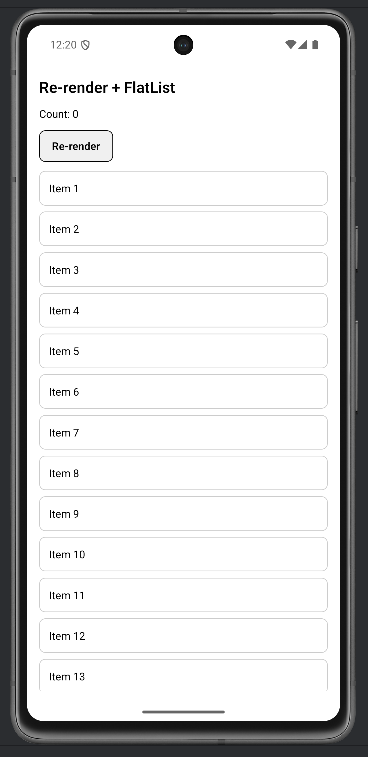
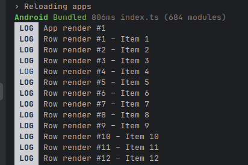
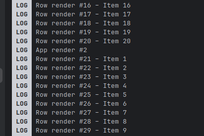

# Lab 02 – Soluzione

## Cosa mostra la soluzione

- Contatore di render con `console.log` per osservare i re-render.
- `FlatList` con `keyExtractor` stabile per liste.
- Edge case: i re-render sono normali, non un bug.

## Codice

### App.tsx

```tsx
import React from "react";
import { FlatList, Pressable, StyleSheet, Text, View } from "react-native";
import { SafeAreaProvider, SafeAreaView } from "react-native-safe-area-context";

let rowRenderCount = 0;

function Row({ title }: { title: string }) {
  rowRenderCount += 1;
  console.log(`Row render #${rowRenderCount} – ${title}`);
  return (
    <View style={styles.row}>
      <Text>{title}</Text>
    </View>
  );
}

const ITEMS = Array.from({ length: 20 }, (_, i) => ({
  id: String(i + 1),
  title: `Item ${i + 1}`,
}));

let appRenderCount = 0;

export default function App() {
  appRenderCount += 1;
  const [count, setCount] = React.useState(0);
  console.log(`App render #${appRenderCount}`);

  return (
    <SafeAreaProvider>
      <SafeAreaView style={{ flex: 1 }}>
        <View style={{ flex: 1, padding: 16, gap: 12 }}>
          <Text style={{ fontSize: 20, fontWeight: "600" }}>Re-render + FlatList</Text>
          <Text>Count: {count}</Text>
          <Pressable style={styles.button} onPress={() => setCount((c) => c + 1)}>
            <Text style={styles.buttonText}>Re-render</Text>
          </Pressable>
          <FlatList
            data={ITEMS}
            keyExtractor={(item) => item.id}
            renderItem={({ item }) => <Row title={item.title} />}
            contentContainerStyle={styles.list}
          />
        </View>
      </SafeAreaView>
    </SafeAreaProvider>
  );
}

const styles = StyleSheet.create({
  row: {
    padding: 12,
    borderWidth: 1,
    borderColor: "#ccc",
    borderRadius: 8,
    marginBottom: 8,
  },
  list: { paddingBottom: 16 },
  button: {
    alignSelf: "flex-start",
    paddingVertical: 10,
    paddingHorizontal: 16,
    borderWidth: 1,
    borderRadius: 8,
    backgroundColor: "#f0f0f0",
  },
  buttonText: { fontWeight: "600" },
});
```

## Screenshot

**FlatList con 20 item — stato iniziale (Count: 0)**



**FlatList dopo 5 re-render (Count: 5)**


**Console log — primo render (App + 12 Row)**



**Console log — secondo render dopo pressione pulsante**


