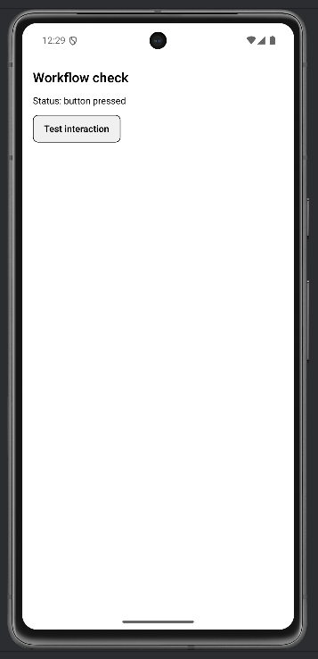

# Lab 03 – Soluzione

## Cosa mostra la soluzione

- Workflow ripetibile: avvio Metro, connessione device/emulatore.
- `useEffect` per log al mount, `Pressable` per interazione.
- Edge case: verificare dove appaiono i log.

## Codice

### App.tsx

```tsx
import React from "react";
import { Pressable, StyleSheet, Text, View } from "react-native";
import { SafeAreaProvider, SafeAreaView } from "react-native-safe-area-context";

export default function App() {
  const [status, setStatus] = React.useState("ready");

  React.useEffect(() => {
    console.log("App mounted");
  }, []);

  return (
    <SafeAreaProvider>
      <SafeAreaView style={{ flex: 1 }}>
        <View style={styles.container}>
          <Text style={styles.title}>Workflow check</Text>
          <Text>Status: {status}</Text>
          <Pressable style={styles.button} onPress={() => setStatus("button pressed")}>
            <Text style={styles.buttonText}>Test interaction</Text>
          </Pressable>
        </View>
      </SafeAreaView>
    </SafeAreaProvider>
  );
}

const styles = StyleSheet.create({
  container: { flex: 1, padding: 16, gap: 12 },
  title: { fontSize: 20, fontWeight: "600" },
  button: {
    alignSelf: "flex-start",
    paddingVertical: 10,
    paddingHorizontal: 16,
    borderWidth: 1,
    borderRadius: 8,
    backgroundColor: "#f0f0f0",
  },
  buttonText: { fontWeight: "600" },
});
```


### Comandi utili

```bash
npx create-expo-app my-app --template blank-typescript
cd my-app
npx expo start
npx expo start --tunnel
npx expo start -c
```

## Screenshot

**App avviata — Status: ready**


**Dopo pressione pulsante — Status: button pressed**



**Console — LOG App mounted**


