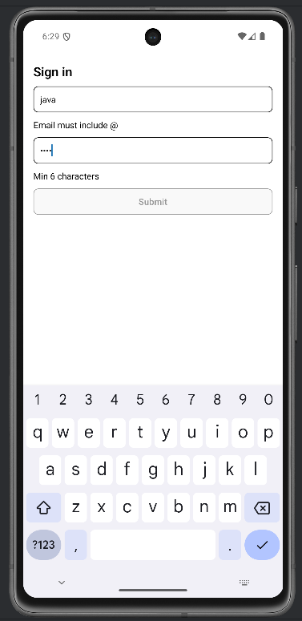

# Lab 09 – Soluzione

## Cosa mostra la soluzione

- Form controllato con `useState`.
- Validazione derivata (no stato duplicato).
- Edge case: errori mostrati solo dopo submit.

## Screenshot




## Codice

### App.tsx

```tsx
import React from "react";
import { Pressable, StyleSheet, Text, TextInput, View } from "react-native";
import { SafeAreaProvider, SafeAreaView } from "react-native-safe-area-context";

export default function App() {
  const [email, setEmail] = React.useState("");
  const [password, setPassword] = React.useState("");
  const [submitted, setSubmitted] = React.useState(false);

  const emailOk = email.includes("@");
  const passwordOk = password.length >= 6;
  const canSubmit = emailOk && passwordOk;

  return (
    <SafeAreaProvider>
      <SafeAreaView style={{ flex: 1 }}>
        <View style={styles.container}>
          <Text style={styles.title}>Sign in</Text>
          <TextInput
            value={email}
            onChangeText={setEmail}
            placeholder="Email"
            autoCapitalize="none"
            style={styles.input}
          />
          {submitted && !emailOk && <Text>Email must include @</Text>}
          <TextInput
            value={password}
            onChangeText={setPassword}
            placeholder="Password"
            secureTextEntry
            style={styles.input}
          />
          {submitted && !passwordOk && <Text>Min 6 characters</Text>}
          <Pressable
            onPress={() => setSubmitted(true)}
            style={[styles.button, !canSubmit && { opacity: 0.4 }]}
          >
            <Text style={styles.buttonText}>Submit</Text>
          </Pressable>
          {submitted && canSubmit && <Text>OK ✓</Text>}
        </View>
      </SafeAreaView>
    </SafeAreaProvider>
  );
}

const styles = StyleSheet.create({
  container: { flex: 1, padding: 16, gap: 10 },
  title: { fontSize: 20, fontWeight: "600" },
  input: { borderWidth: 1, borderRadius: 8, padding: 10 },
  button: {
    paddingVertical: 10,
    paddingHorizontal: 16,
    borderRadius: 8,
    borderWidth: 1,
    alignItems: "center",
    backgroundColor: "#f0f0f0",
  },
  buttonText: { fontWeight: "600" },
});
```
