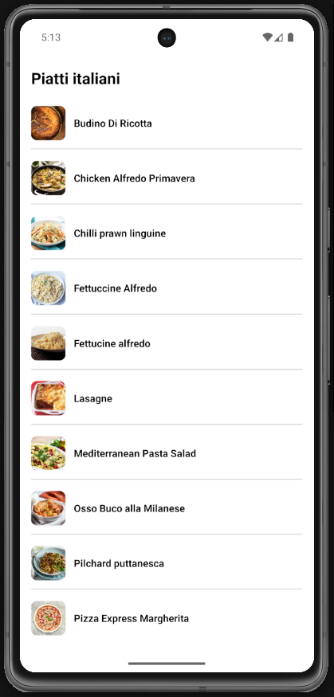
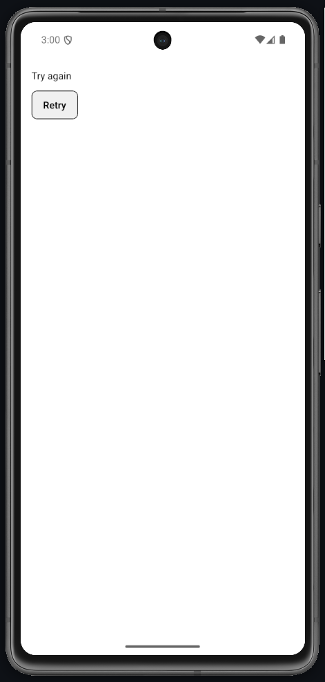
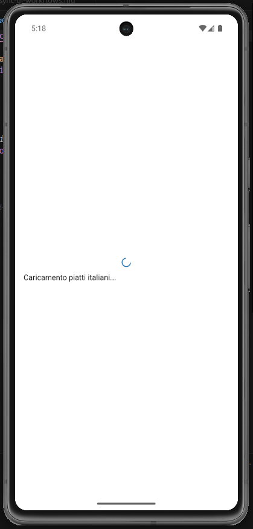

# Lab 15 – Soluzione (Italian Meals App)

## Cosa mostra la soluzione

- `fetch` TheMealDB con controllo `res.ok` in `services/mealsApi.ts`.
- Oggetto stato unico `{ status, items, message }` su `MealsListScreen`.
- Stesso pattern `{ status, meal, message }` su `MealDetailScreen`.
- Edge case: errore HTTP/rete → Retry.

## Screenshot







## Codice

### services/mealsApi.ts

```ts
const BASE = "https://www.themealdb.com/api/json/v1/1";

export async function fetchItalianMeals() {
  const res = await fetch(`${BASE}/filter.php?a=Italian`);
  if (!res.ok) throw new Error(`HTTP ${res.status}`);
  const data = await res.json();
  return data.meals ?? [];
}

export async function fetchMealById(id: string) {
  const res = await fetch(`${BASE}/lookup.php?i=${id}`);
  if (!res.ok) throw new Error(`HTTP ${res.status}`);
  const data = await res.json();
  return data.meals?.[0] ?? null;
}
```

### App.tsx

```tsx
import React from "react";
import {
  ActivityIndicator,
  FlatList,
  Image,
  Pressable,
  StyleSheet,
  Text,
  View,
} from "react-native";
import { SafeAreaProvider, SafeAreaView } from "react-native-safe-area-context";
import { fetchItalianMeals } from "./services/mealsApi";

interface MealSummary {
  idMeal: string;
  strMeal: string;
  strMealThumb: string;
}

export default function App() {
  const [state, setState] = React.useState<{
    status: "idle" | "loading" | "success" | "error";
    items: MealSummary[];
    message: string;
  }>({
    status: "idle",
    items: [],
    message: "",
  });

  async function loadMeals() {
    setState({ status: "loading", items: [], message: "" });
    try {
      const data = await fetchItalianMeals();
      setState({ status: "success", items: data, message: "" });
    } catch {
      setState({
        status: "error",
        items: [],
        message: "Caricamento fallito. Controlla la connessione.",
      });
    }
  }

  React.useEffect(() => {
    loadMeals();
  }, []);

  if (state.status === "loading") {
    return (
      <SafeAreaProvider>
        <SafeAreaView style={styles.centered}>
          <ActivityIndicator />
          <Text>Caricamento piatti italiani...</Text>
        </SafeAreaView>
      </SafeAreaProvider>
    );
  }

  if (state.status === "error") {
    return (
      <SafeAreaProvider>
        <SafeAreaView style={styles.container}>
          <Text style={styles.error}>{state.message}</Text>
          <Pressable style={styles.button} onPress={loadMeals}>
            <Text style={styles.buttonText}>Retry</Text>
          </Pressable>
        </SafeAreaView>
      </SafeAreaProvider>
    );
  }

  return (
    <SafeAreaProvider>
      <SafeAreaView style={styles.container}>
        <Text style={styles.title}>Piatti italiani</Text>
        {state.items.length === 0 ? (
          <Text>Nessun piatto italiano disponibile.</Text>
        ) : (
          <FlatList
            data={state.items}
            keyExtractor={(item) => item.idMeal}
            contentContainerStyle={{ gap: 4 }}
            renderItem={({ item }) => (
              <View style={styles.row}>
                <Image source={{ uri: item.strMealThumb }} style={styles.thumb} />
                <Text style={styles.mealName} numberOfLines={2}>
                  {item.strMeal}
                </Text>
              </View>
            )}
          />
        )}
      </SafeAreaView>
    </SafeAreaProvider>
  );
}

const styles = StyleSheet.create({
  container: { flex: 1, padding: 16, gap: 12 },
  centered: { flex: 1, padding: 16, gap: 8, justifyContent: "center" },
  title: { fontSize: 22, fontWeight: "700" },
  error: { color: "#B00020" },
  button: {
    alignSelf: "flex-start",
    paddingVertical: 10,
    paddingHorizontal: 16,
    borderWidth: 1,
    borderRadius: 8,
    backgroundColor: "#f0f0f0",
  },
  buttonText: { fontWeight: "600" },
  row: {
    flexDirection: "row",
    alignItems: "center",
    gap: 12,
    paddingVertical: 12,
    borderBottomWidth: 1,
    borderBottomColor: "#ccc",
  },
  thumb: { width: 48, height: 48, borderRadius: 8 },
  mealName: { flex: 1, fontWeight: "600" },
});
```
