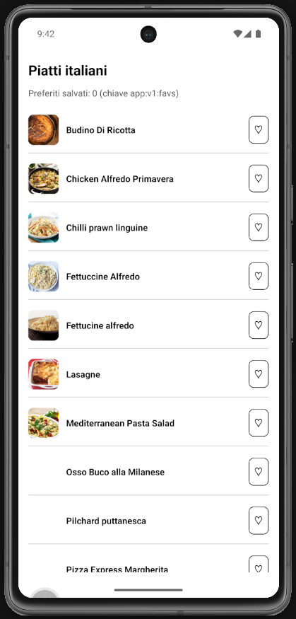

# Lab 16 – Soluzione (Italian Meals App)

## Cosa mostra la soluzione

- Persistenza preferiti con chiave **`app:v1:favs`**.
- `loadFavoriteIds` / `saveFavoriteIds` in `services/storage.ts`.
- Toggle ♡ / ♥ su lista e dettaglio.
- Edge case: chiave assente o JSON corrotto → array vuoto.

## Screenshot attesi

**Lista piatti - nessun preferito (Preferiti salvati: 0, cuori vuoti ♡)**



**Lista piatti - preferiti persistiti dopo riavvio (Preferiti salvati: 3, cuori pieni ♥)**


## File

```text
services/mealsApi.ts
services/storage.ts
App.tsx
```

## Codice

### services/mealsApi.ts

```ts
const BASE = "https://www.themealdb.com/api/json/v1/1";

export async function fetchItalianMeals() {
  const res = await fetch(`${BASE}/filter.php?a=Italian`);
  if (!res.ok) throw new Error(`HTTP ${res.status}`);
  const data = await res.json();
  return data.meals ?? [];
}

export async function fetchMealById(id: string) {
  const res = await fetch(`${BASE}/lookup.php?i=${id}`);
  if (!res.ok) throw new Error(`HTTP ${res.status}`);
  const data = await res.json();
  return data.meals?.[0] ?? null;
}
```

### services/storage.ts

```ts
import AsyncStorage from "@react-native-async-storage/async-storage";

export const FAVORITES_KEY = "app:v1:favs";

export async function loadFavoriteIds(): Promise<string[]> {
  try {
    const raw = await AsyncStorage.getItem(FAVORITES_KEY);
    if (!raw) return [];
    const parsed = JSON.parse(raw) as unknown;
    return Array.isArray(parsed)
      ? parsed.filter((id): id is string => typeof id === "string")
      : [];
  } catch {
    return [];
  }
}

export async function saveFavoriteIds(ids: string[]): Promise<void> {
  try {
    await AsyncStorage.setItem(FAVORITES_KEY, JSON.stringify(ids));
  } catch {
    // ignora errori storage in dev
  }
}
```

### App.tsx

```tsx
import React from "react";
import {
  ActivityIndicator,
  FlatList,
  Image,
  Pressable,
  StyleSheet,
  Text,
  View,
} from "react-native";
import { SafeAreaProvider, SafeAreaView } from "react-native-safe-area-context";
import { fetchItalianMeals } from "./services/mealsApi";
import { loadFavoriteIds, saveFavoriteIds } from "./services/storage";

interface MealSummary {
  idMeal: string;
  strMeal: string;
  strMealThumb: string;
}

export default function App() {
  const [state, setState] = React.useState<{
    status: "idle" | "loading" | "success" | "error";
    items: MealSummary[];
    message: string;
  }>({
    status: "idle",
    items: [],
    message: "",
  });
  const [favoriteIds, setFavoriteIds] = React.useState<string[]>([]);
  const [favoritesLoaded, setFavoritesLoaded] = React.useState(false);

  React.useEffect(() => {
    loadFavoriteIds()
      .then(setFavoriteIds)
      .finally(() => setFavoritesLoaded(true));
  }, []);

  async function loadMeals() {
    setState({ status: "loading", items: [], message: "" });
    try {
      const data = await fetchItalianMeals();
      setState({ status: "success", items: data, message: "" });
    } catch {
      setState({
        status: "error",
        items: [],
        message: "Caricamento fallito. Controlla la connessione.",
      });
    }
  }

  React.useEffect(() => {
    loadMeals();
  }, []);

  function toggleFavorite(idMeal: string) {
    setFavoriteIds((current) => {
      const next = current.includes(idMeal)
        ? current.filter((id) => id !== idMeal)
        : [...current, idMeal];
      void saveFavoriteIds(next);
      return next;
    });
  }

  if (!favoritesLoaded || state.status === "loading") {
    return (
      <SafeAreaProvider>
        <SafeAreaView style={styles.centered}>
          <ActivityIndicator />
          <Text>Caricamento...</Text>
        </SafeAreaView>
      </SafeAreaProvider>
    );
  }

  if (state.status === "error") {
    return (
      <SafeAreaProvider>
        <SafeAreaView style={styles.container}>
          <Text style={styles.error}>{state.message}</Text>
          <Pressable style={styles.button} onPress={loadMeals}>
            <Text style={styles.buttonText}>Retry</Text>
          </Pressable>
        </SafeAreaView>
      </SafeAreaProvider>
    );
  }

  return (
    <SafeAreaProvider>
      <SafeAreaView style={styles.container}>
        <Text style={styles.title}>Piatti italiani</Text>
        <Text style={styles.subtitle}>
          Preferiti salvati: {favoriteIds.length} (chiave app:v1:favs)
        </Text>
        <FlatList
          data={state.items}
          keyExtractor={(item) => item.idMeal}
          contentContainerStyle={{ gap: 4 }}
          renderItem={({ item }) => {
            const active = favoriteIds.includes(item.idMeal);
            return (
              <View style={styles.row}>
                <Image source={{ uri: item.strMealThumb }} style={styles.thumb} />
                <Text style={styles.mealName} numberOfLines={2}>
                  {item.strMeal}
                </Text>
                <Pressable
                  style={styles.favButton}
                  onPress={() => toggleFavorite(item.idMeal)}
                >
                  <Text style={styles.favText}>{active ? "♥" : "♡"}</Text>
                </Pressable>
              </View>
            );
          }}
        />
      </SafeAreaView>
    </SafeAreaProvider>
  );
}

const styles = StyleSheet.create({
  container: { flex: 1, padding: 16, gap: 12 },
  centered: { flex: 1, padding: 16, gap: 8, justifyContent: "center" },
  title: { fontSize: 22, fontWeight: "700" },
  subtitle: { color: "#555" },
  error: { color: "#B00020" },
  button: {
    alignSelf: "flex-start",
    paddingVertical: 10,
    paddingHorizontal: 16,
    borderWidth: 1,
    borderRadius: 8,
    backgroundColor: "#f0f0f0",
  },
  buttonText: { fontWeight: "600" },
  row: {
    flexDirection: "row",
    alignItems: "center",
    gap: 12,
    paddingVertical: 12,
    borderBottomWidth: 1,
    borderBottomColor: "#ccc",
  },
  thumb: { width: 48, height: 48, borderRadius: 8 },
  mealName: { flex: 1, fontWeight: "600" },
  favButton: { padding: 8, borderWidth: 1, borderRadius: 8 },
  favText: { fontSize: 18 },
});
```
