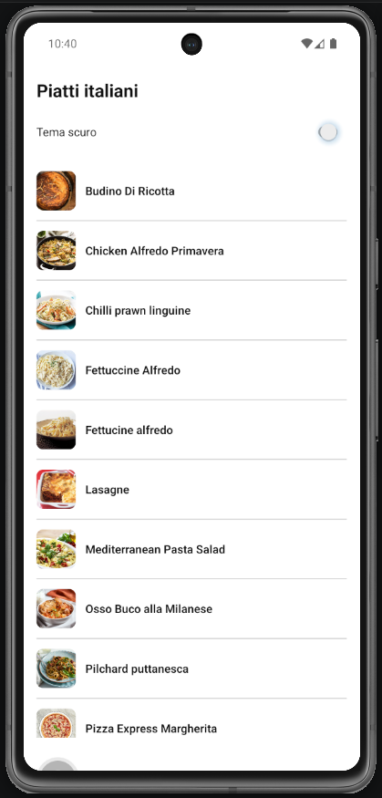
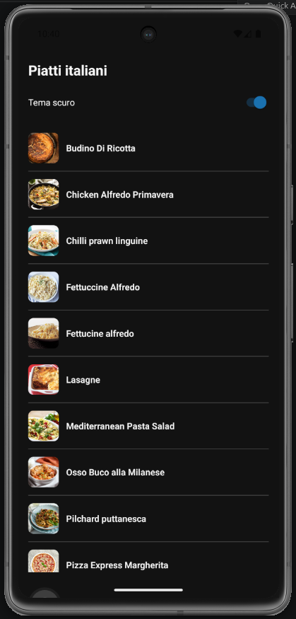

# Lab 19 – Soluzione (Italian Meals App)

## Cosa mostra la soluzione

- `lightTheme` / `darkTheme` con design tokens.
- `ThemeContext` + persistenza `app:v1:theme`.
- `createSharedStyles(theme)` — colori adattivi su tutte le screen.
- `accessibilityLabel` su `MealCard`; feedback `Pressable` su pressione.
- Switch tema scuro in **SettingsScreen**.

## Screenshot





## File

```text
services/mealsApi.ts
App.tsx
```

## Codice

### services/mealsApi.ts

```ts
const BASE = "https://www.themealdb.com/api/json/v1/1";

export async function fetchItalianMeals() {
  const res = await fetch(`${BASE}/filter.php?a=Italian`);
  if (!res.ok) throw new Error(`HTTP ${res.status}`);
  const data = await res.json();
  return data.meals ?? [];
}

export async function fetchMealById(id: string) {
  const res = await fetch(`${BASE}/lookup.php?i=${id}`);
  if (!res.ok) throw new Error(`HTTP ${res.status}`);
  const data = await res.json();
  return data.meals?.[0] ?? null;
}
```

### App.tsx (Provider tree)

```tsx
import React from "react";
import {
  ActivityIndicator,
  FlatList,
  Image,
  Pressable,
  StyleSheet,
  Switch,
  Text,
  View,
} from "react-native";
import { SafeAreaProvider, SafeAreaView } from "react-native-safe-area-context";
import { fetchItalianMeals } from "./services/mealsApi";

interface MealSummary {
  idMeal: string;
  strMeal: string;
  strMealThumb: string;
}

const lightTheme = {
  background: "#ffffff",
  text: "#111111",
  border: "#cccccc",
  muted: "#555555",
  card: "#fafafa",
};

const darkTheme = {
  background: "#121212",
  text: "#f5f5f5",
  border: "#444444",
  muted: "#b0b0b0",
  card: "#1e1e1e",
};

export default function App() {
  const [isDark, setIsDark] = React.useState(false);
  const theme = isDark ? darkTheme : lightTheme;
  const [state, setState] = React.useState<{
    status: "idle" | "loading" | "success" | "error";
    items: MealSummary[];
    message: string;
  }>({
    status: "idle",
    items: [],
    message: "",
  });

  async function loadMeals() {
    setState({ status: "loading", items: [], message: "" });
    try {
      const data = await fetchItalianMeals();
      setState({ status: "success", items: data, message: "" });
    } catch {
      setState({
        status: "error",
        items: [],
        message: "Caricamento fallito.",
      });
    }
  }

  React.useEffect(() => {
    loadMeals();
  }, []);

  const styles = React.useMemo(
    () =>
      StyleSheet.create({
        container: {
          flex: 1,
          padding: 16,
          gap: 12,
          backgroundColor: theme.background,
        },
        centered: {
          flex: 1,
          padding: 16,
          gap: 8,
          justifyContent: "center",
          backgroundColor: theme.background,
        },
        title: { fontSize: 22, fontWeight: "700", color: theme.text },
        subtitle: { color: theme.muted },
        switchRow: { flexDirection: "row", alignItems: "center", gap: 12 },
        switchLabel: { flex: 1, color: theme.text },
        error: { color: "#B00020" },
        button: {
          alignSelf: "flex-start",
          paddingVertical: 10,
          paddingHorizontal: 16,
          borderWidth: 1,
          borderColor: theme.border,
          borderRadius: 8,
          backgroundColor: theme.card,
        },
        buttonText: { fontWeight: "600", color: theme.text },
        row: {
          flexDirection: "row",
          alignItems: "center",
          gap: 12,
          paddingVertical: 12,
          borderBottomWidth: 1,
          borderBottomColor: theme.border,
        },
        thumb: { width: 48, height: 48, borderRadius: 8 },
        mealName: { flex: 1, fontWeight: "600", color: theme.text },
        pressed: { opacity: 0.7 },
      }),
    [theme],
  );

  if (state.status === "loading") {
    return (
      <SafeAreaProvider>
        <SafeAreaView style={styles.centered}>
          <ActivityIndicator />
          <Text style={{ color: theme.text }}>Caricamento...</Text>
        </SafeAreaView>
      </SafeAreaProvider>
    );
  }

  if (state.status === "error") {
    return (
      <SafeAreaProvider>
        <SafeAreaView style={styles.container}>
          <Text style={styles.error}>{state.message}</Text>
          <Pressable style={styles.button} onPress={loadMeals}>
            <Text style={styles.buttonText}>Retry</Text>
          </Pressable>
        </SafeAreaView>
      </SafeAreaProvider>
    );
  }

  return (
    <SafeAreaProvider>
      <SafeAreaView style={styles.container}>
        <Text accessibilityRole="header" style={styles.title}>
          Piatti italiani
        </Text>
        <View style={styles.switchRow}>
          <Text style={styles.switchLabel}>Tema scuro</Text>
          <Switch
            accessibilityLabel="Attiva o disattiva tema scuro"
            value={isDark}
            onValueChange={setIsDark}
          />
        </View>
        <FlatList
          data={state.items}
          keyExtractor={(item) => item.idMeal}
          renderItem={({ item }) => (
            <Pressable
              accessibilityRole="button"
              accessibilityLabel={`Apri ${item.strMeal}`}
              style={({ pressed }) => [styles.row, pressed && styles.pressed]}
            >
              <Image source={{ uri: item.strMealThumb }} style={styles.thumb} />
              <Text
                style={styles.mealName}
                maxFontSizeMultiplier={1.4}
                numberOfLines={2}
              >
                {item.strMeal}
              </Text>
            </Pressable>
          )}
        />
      </SafeAreaView>
    </SafeAreaProvider>
  );
}
```
