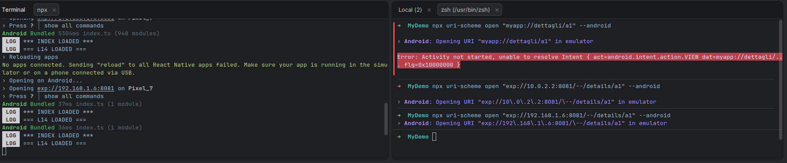
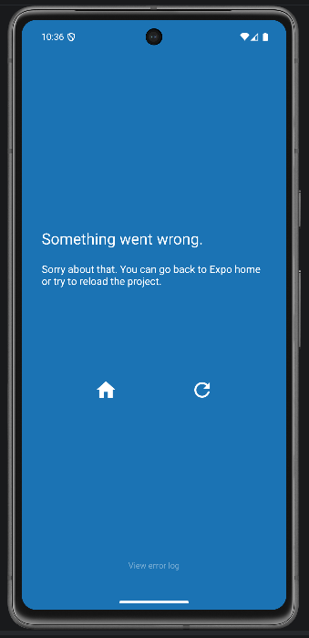

# React Native Programming - Cheat Sheet

**Instructor:** Seyedhossein Javadizavieh  
**Course:** React Native (WMD)

## Table of Contents

| #   | Topic                                             |
| --- | ------------------------------------------------- |
| 1   | Project setup (Expo)                              |
| 2   | Core component imports                            |
| 3   | View - the universal container                    |
| 4   | Text - rendering text content                     |
| 5   | Image - local and remote                          |
| 6   | Pressable - handling taps                         |
| 7   | ScrollView vs FlatList                            |
| 8   | TextInput - controlled input                      |
| 9   | useState - reactive state                         |
| 10  | useEffect - side effects and cleanup              |
| 11a | StyleSheet                                        |
| 11b | Flexbox quick reference                           |
| 12  | Conditional rendering patterns                    |
| 13  | Forms - validation pattern                        |
| 14  | fetch - REST API calls                            |
| 15  | Async data pattern (load → show → error)          |
| 16  | React Navigation - setup                          |
| 17  | Navigation - navigate, params, goBack             |
| 18  | Tab and Drawer navigators                         |
| 19  | AsyncStorage - local persistence                  |
| 20  | Context - sharing state globally                  |
| 21  | Zustand - lightweight global store                |
| 22  | Custom hooks - reusable logic                     |
| 23  | Responsive StyleSheet and Flexbox                 |
| 24  | Permissions (expo)                                |
| 25  | Notifications (expo)                              |
| 26  | Deep linking                                      |
| 27  | Animated - basic animations                       |
| 28  | Platform-specific code                            |
| 29  | Common project structure                          |
| 30  | Debugging checklist                               |
| 31  | ADB guide (Ubuntu / macOS / Windows)              |
| 32  | Connect Android device (Expo Go + USB + emulator) |
| 33  | Connect iPhone (Expo Go + simulator)              |
| 34  | Developer menu and debug tools                    |
| 35  | Device connection troubleshooting                 |

## 1 · Project setup (Expo)

```bash
# Create a new project
npx create-expo-app MyApp --template blank-typescript
cd MyApp

# Start the dev server
npx expo start

# Run on a specific platform
npx expo start --android
npx expo start --ios
```

- **Fast Refresh** - save a file and changes appear instantly
- Press `r` in terminal to **reload**, `m` to open **dev menu**
- Use `npx expo install <pkg>` to install **compatible** versions

## 2 · Core component imports

```tsx
import {
  View, // container (like <div>)
  Text, // all text must be inside <Text>
  Image, // local or remote images
  TextInput, // text field
  Pressable, // tappable wrapper (replaces TouchableOpacity)
  ScrollView, // scrollable area (small content)
  FlatList, // virtualized list (large content)
  SectionList, // grouped virtualized list
  ActivityIndicator, // spinner
  Switch, // toggle
  Modal, // overlay dialog
  StatusBar, // control status bar appearance
  StyleSheet, // create optimized style objects
} from "react-native";
```

## 3 · View - the universal container

```tsx
// View is a flexbox container (column by default)
<View style={{ flex: 1, padding: 16, gap: 12 }}>
  <Text>First</Text>
  <Text>Second</Text>
</View>
```

- Every layout starts with **View**
- Defaults to `flexDirection: 'column'`
- Use `gap` for spacing between children (RN 0.71+)
- **Cannot** display raw text - always wrap in `<Text>`

## 4 · Text - rendering text content

```tsx
// Basic text with inline styles
<Text style={{ fontSize: 18, fontWeight: '600', color: '#333' }}>
  Hello React Native
</Text>

// Nested text inherits parent styles
<Text style={{ fontSize: 16 }}>
  Normal <Text style={{ fontWeight: 'bold' }}>Bold</Text> normal
</Text>

// Truncation
<Text numberOfLines={2} ellipsizeMode="tail">
  Very long text that will be cut after two lines...
</Text>
```

## 5 · Image - local and remote

```tsx
// Remote image (must set width + height)
<Image
  source={{ uri: 'https://example.com/photo.jpg' }}
  style={{ width: 200, height: 150, borderRadius: 12 }}
/>

// Local image (dimensions auto-detected)
<Image
  source={require('./assets/logo.png')}
  style={{ width: 100, height: 100 }}
  resizeMode="contain"
/>
```

**resizeMode** values: `cover` | `contain` | `stretch` | `center`

## 6 · Pressable - handling taps

```tsx
// Pressable with visual feedback
<Pressable
  onPress={() => console.log("Tapped!")}
  onLongPress={() => console.log("Long press!")}
  style={({ pressed }) => ({
    opacity: pressed ? 0.6 : 1,
    padding: 14,
    backgroundColor: "#007AFF",
    borderRadius: 8,
  })}
>
  <Text style={{ color: "#fff", textAlign: "center" }}>Tap me</Text>
</Pressable>
```

- Prefer **Pressable** over `TouchableOpacity` (newer API)
- `style` accepts a **function** for pressed state feedback

## 7 · ScrollView vs FlatList

```tsx
interface Item {
  id: string;
  title: string;
}

// ScrollView - renders ALL children at once
<ScrollView contentContainerStyle={{ padding: 16 }}>
  <Text>Item 1</Text>
  <Text>Item 2</Text>
</ScrollView>

// FlatList - virtualised, only renders visible rows
<FlatList<Item>
  data={items}
  keyExtractor={(item: Item) => item.id}
  renderItem={({ item }: { item: Item }) => <Text>{item.name}</Text>}
  ListEmptyComponent={<Text>No items</Text>}
/>
```

| Use case                  | Component       |
| ------------------------- | --------------- |
| < 50 items, mixed content | **ScrollView**  |
| Large list, uniform rows  | **FlatList**    |
| Grouped sections          | **SectionList** |

## 8 · TextInput - controlled input

```tsx
const [email, setEmail] = React.useState("");

// Controlled: value always reflects state
<TextInput
  value={email}
  onChangeText={setEmail}
  placeholder="Email"
  keyboardType="email-address"
  autoCapitalize="none"
  autoCorrect={false}
  style={{
    borderWidth: 1,
    borderColor: "#ccc",
    borderRadius: 8,
    padding: 12,
    color: "#fff",
  }}
/>;
```

Common **keyboardType** values: `default` | `email-address` | `numeric` | `phone-pad`

## 9 · useState - reactive state

```tsx
import React from "react";

// Declare state with initial value
const [count, setCount] = React.useState(0);
const [items, setItems] = React.useState<string[]>([]);
const [user, setUser] = React.useState<{ name: string } | null>(null);

// Update state (triggers re-render)
setCount(10);
setCount((prev) => prev + 1);

// Update object/array state (immutable patterns)
setUser((prev) => ({ ...prev, name: "Ada" }));
setItems((prev) => [...prev, newItem]);
setItems((prev) => prev.filter((i) => i.id !== id));
```

- State is **immutable** - always create a new reference
- Use **callback form** when new value depends on previous

## 10 · useEffect - side effects and cleanup

```tsx
// Run once on mount
React.useEffect(() => {
  fetchData();
}, []);

// Run when dependency changes
React.useEffect(() => {
  filterResults(query);
}, [query]);

// Cleanup on unmount (subscriptions, timers)
React.useEffect(() => {
  const id = setInterval(tick, 1000);
  return () => clearInterval(id);
}, []);
```

| Dependency array | Runs when                   |
| ---------------- | --------------------------- |
| `[]`             | Once on **mount**           |
| `[a, b]`         | When **a** or **b** changes |
| _(omitted)_      | Every render (avoid)        |

## 11a · StyleSheet

```tsx
const styles = StyleSheet.create({
  container: {
    flex: 1,
    flexDirection: "row",
    justifyContent: "center",
    alignItems: "center",
    gap: 12,
  },
  card: {
    padding: 16,
    backgroundColor: "#1e1e1e",
    borderRadius: 12,
    shadowColor: "#000",
    shadowOffset: { width: 0, height: 2 },
    shadowOpacity: 0.25,
    shadowRadius: 4,
    elevation: 5,
  },
});
```

- `StyleSheet.create` validates and **optimises** style objects
- Combine styles: `style={[styles.card, { marginTop: 8 }]}`

## 11b · Flexbox quick reference

| Property           | Values                                                  |
| ------------------ | ------------------------------------------------------- |
| **flexDirection**  | `column` (default), `row`                               |
| **justifyContent** | `flex-start`, `center`, `flex-end`                      |
|                    | `space-between`, `space-around`, `space-evenly`         |
| **alignItems**     | `stretch` (default), `flex-start`, `center`, `flex-end` |
| **flexWrap**       | `nowrap` (default), `wrap`                              |
| **gap**            | number (e.g. `12`) - spacing between children           |
| **flex**           | `1` - fill available space                              |
| **alignSelf**      | override parent `alignItems` for one child              |
| **position**       | `relative` (default), `absolute`                        |

## 12 · Conditional rendering patterns

```tsx
interface Item {
  id: string;
  title: string;
}

// Short-circuit
{
  isLoading && <ActivityIndicator />;
}

// Ternary
{
  error ? <Text>{error}</Text> : <DataView data={data} />;
}

// Early return
if (loading) return <ActivityIndicator />;
if (error) return <Text>Error: {error}</Text>;
return <DataView data={data} />;

// Rendering a list
{
  items.map((item: Item) => <Text key={item.id}>{item.name}</Text>);
}
```

## 13 · Forms - validation pattern

```tsx
const [email, setEmail] = React.useState("");
const [touched, setTouched] = React.useState(false);

const emailOk = email.includes("@");
const showError = touched && !emailOk;

<TextInput
  value={email}
  onChangeText={setEmail}
  onBlur={() => setTouched(true)}
  placeholder="Email"
/>;

// Show error only after the user interacts
{
  showError && <Text style={{ color: "#ff4444" }}>Invalid email</Text>;
}

// Disable submit until valid
<Pressable
  disabled={!emailOk}
  style={{ opacity: emailOk ? 1 : 0.4 }}
  onPress={handleSubmit}
>
  <Text>Submit</Text>
</Pressable>;
```

## 14 · fetch - REST API calls

```tsx
// GET request
const response = await fetch("https://api.example.com/items");
const data = await response.json();

// POST request
const response = await fetch("https://api.example.com/items", {
  method: "POST",
  headers: { "Content-Type": "application/json" },
  body: JSON.stringify({ title: "New item" }),
});

// DELETE request
await fetch(`https://api.example.com/items/${id}`, {
  method: "DELETE",
});
```

## 15 · Async data pattern (load → show → error)

```tsx
interface Item {
  id: string;
  title: string;
}

const [data, setData] = React.useState<Item[] | null>(null);
const [loading, setLoading] = React.useState(true);
const [error, setError] = React.useState<string | null>(null);

React.useEffect(() => {
  const load = async () => {
    try {
      const res = await fetch(URL);
      const json = await res.json();
      setData(json);
    } catch (e) {
      setError(e.message);
    } finally {
      setLoading(false);
    }
  };
  load();
}, []);

// Render based on state
if (loading) return <ActivityIndicator />;
if (error) return <Text>Error: {error}</Text>;
return <FlatList<Item> data={data} /* ... */ />;
```

## 16 · React Navigation - setup

```bash
npx expo install @react-navigation/native
npx expo install @react-navigation/native-stack
npx expo install react-native-screens react-native-safe-area-context
```

```tsx
// App.tsx
import { NavigationContainer } from "@react-navigation/native";
import { createNativeStackNavigator } from "@react-navigation/native-stack";

type RootStackParamList = {
  Home: undefined;
  Detail: { id: number };
};

const Stack = createNativeStackNavigator<RootStackParamList>();

export default function App() {
  return (
    <NavigationContainer>
      <Stack.Navigator initialRouteName="Home">
        <Stack.Screen name="Home" component={HomeScreen} />
        <Stack.Screen name="Detail" component={DetailScreen} />
      </Stack.Navigator>
    </NavigationContainer>
  );
}
```

## 17 · Navigation - navigate, params, goBack

```tsx
import type { NativeStackScreenProps } from "@react-navigation/native-stack";

type RootStackParamList = {
  [screen: string]: object | undefined;
};

// Navigate to a screen with params
function HomeScreen({
  navigation,
}: NativeStackScreenProps<RootStackParamList>) {
  return (
    <Pressable onPress={() => navigation.navigate("Detail", { id: 42 })}>
      <Text>Go to Detail</Text>
    </Pressable>
  );
}

// Read params on the target screen
function DetailScreen({
  route,
  navigation,
}: NativeStackScreenProps<RootStackParamList>) {
  const { id } = route.params;
  return (
    <View>
      <Text>Item ID: {id}</Text>
      <Pressable onPress={() => navigation.goBack()}>
        <Text>Back</Text>
      </Pressable>
    </View>
  );
}
```

## 18 · Tab and Drawer navigators

```tsx
// Bottom tabs
import { createBottomTabNavigator } from "@react-navigation/bottom-tabs";
const Tab = createBottomTabNavigator();

<Tab.Navigator>
  <Tab.Screen name="Feed" component={FeedScreen} />
  <Tab.Screen name="Profile" component={ProfileScreen} />
</Tab.Navigator>;

// Drawer
import { createDrawerNavigator } from "@react-navigation/drawer";
const Drawer = createDrawerNavigator();

<Drawer.Navigator>
  <Drawer.Screen name="Home" component={HomeScreen} />
  <Drawer.Screen name="Settings" component={SettingsScreen} />
</Drawer.Navigator>;
```

- **Nest** navigators: Tab inside Stack, Drawer wrapping Stack

## 19 · AsyncStorage - local persistence

```tsx
import AsyncStorage from "@react-native-async-storage/async-storage";

// Save a value
await AsyncStorage.setItem("token", "abc123");

// Save an object (must stringify)
await AsyncStorage.setItem("user", JSON.stringify(user));

// Read a value
const token = await AsyncStorage.getItem("token");

// Read an object (must parse)
const raw = await AsyncStorage.getItem("user");
const user = raw ? JSON.parse(raw) : null;

// Remove
await AsyncStorage.removeItem("token");

// Clear everything
await AsyncStorage.clear();
```

## 20 · Context - sharing state globally

```tsx
// 1. Create context
interface AuthValue {
  user: { name: string } | null;
  setUser: React.Dispatch<React.SetStateAction<{ name: string } | null>>;
}

const AuthContext = React.createContext<AuthValue | null>(null);

// 2. Provider wraps app tree
interface AuthProviderProps {
  children: React.ReactNode;
}

function AuthProvider({ children }: AuthProviderProps) {
  const [user, setUser] = React.useState<{ name: string } | null>(null);
  return (
    <AuthContext.Provider value={{ user, setUser }}>
      {children}
    </AuthContext.Provider>
  );
}

// 3. Consume anywhere with useContext
function ProfileScreen() {
  const { user } = React.useContext(AuthContext);
  return <Text>{user?.name ?? "Guest"}</Text>;
}
```

- Context is for **low-frequency** updates (auth, theme, locale)
- For **high-frequency** state, prefer **Zustand** or **Redux**

## 21 · Zustand - lightweight global store

```tsx
import { create } from "zustand";

// Define store
interface CartItem {
  id: string;
  name: string;
}

interface CartState {
  items: CartItem[];
  addItem: (item: CartItem) => void;
  removeItem: (id: string) => void;
  clear: () => void;
}

const useCartStore = create<CartState>((set) => ({
  items: [],
  addItem: (item) => set((s) => ({ items: [...s.items, item] })),
  removeItem: (id) =>
    set((s) => ({ items: s.items.filter((i) => i.id !== id) })),
  clear: () => set({ items: [] }),
}));

// Use in any component (no Provider needed)
function CartBadge() {
  const count = useCartStore((s) => s.items.length);
  return <Text>Cart: {count}</Text>;
}
```

## 22 · Custom hooks - reusable logic

```tsx
// useFetch - generic data fetcher
function useFetch<T = unknown>(url: string) {
  const [data, setData] = React.useState<T | null>(null);
  const [loading, setLoading] = React.useState(true);
  const [error, setError] = React.useState<string | null>(null);

  React.useEffect(() => {
    let cancelled = false;
    (async () => {
      try {
        const res = await fetch(url);
        const json = await res.json();
        if (!cancelled) setData(json);
      } catch (e) {
        if (!cancelled) setError(e.message);
      } finally {
        if (!cancelled) setLoading(false);
      }
    })();
    return () => {
      cancelled = true;
    };
  }, [url]);

  return { data, loading, error };
}
```

## 23 · Responsive StyleSheet and Flexbox

```tsx
import { Dimensions, useWindowDimensions } from "react-native";

// Hook (updates on rotation)
function MyComponent() {
  const { width, height } = useWindowDimensions();
  const isLandscape = width > height;

  return (
    <View
      style={{
        flexDirection: isLandscape ? "row" : "column",
        padding: width > 600 ? 32 : 16,
      }}
    >
      <Text>Adaptive layout</Text>
    </View>
  );
}

// Percentage-based
<View style={{ width: "80%", alignSelf: "center" }} />;
```

## 24 · Permissions (expo)

```tsx
import * as Location from "expo-location";
import * as ImagePicker from "expo-image-picker";

// Location
const { status } = await Location.requestForegroundPermissionsAsync();
if (status === "granted") {
  const loc = await Location.getCurrentPositionAsync({});
  console.log(loc.coords.latitude, loc.coords.longitude);
}

// Camera / Gallery
const { status } = await ImagePicker.requestCameraPermissionsAsync();
if (status === "granted") {
  const result = await ImagePicker.launchCameraAsync({
    allowsEditing: true,
    quality: 0.8,
  });
  if (!result.canceled) console.log(result.assets[0].uri);
}
```

## 25 · Notifications (expo)

```tsx
import * as Notifications from "expo-notifications";

// Request permission
const { status } = await Notifications.requestPermissionsAsync();

// Schedule a local notification
await Notifications.scheduleNotificationAsync({
  content: {
    title: "Reminder",
    body: "Check your tasks!",
  },
  trigger: { seconds: 10 },
});

// Listen for received notifications
React.useEffect(() => {
  const sub = Notifications.addNotificationReceivedListener((n) =>
    console.log(n),
  );
  return () => sub.remove();
}, []);
```

## 26 · Deep linking

Works on **Windows, Linux, and Mac**. Lab 14 uses Expo Go + `exp://` URLs.

### How it works (2 layers)

```
myapp://details/a1   or   exp://HOST:8081/--/details/a1
              │
              ▼
┌──────────────────────────────────────────┐
│ Layer 1 - Native (app.json)              │
│ "scheme": "myapp" → which APP opens?     │
└──────────────────────────────────────────┘
              │
              ▼
┌──────────────────────────────────────────┐
│ Layer 2 - Routing (App.tsx prefixes)     │
│ Linking.createURL("/") + "myapp://"        │
│ → which SCREEN? (Details, Home…)          │
└──────────────────────────────────────────┘
```

| Setting                  | File       | Job                                   |
| ------------------------ | ---------- | ------------------------------------- |
| `"scheme": "myapp"`      | `app.json` | Registers `myapp://` (dev build only) |
| `Linking.createURL("/")` | `App.tsx`  | Parses `exp://...` (Expo Go)          |
| `"myapp://"`             | `App.tsx`  | Parses `myapp://...` (dev build)      |
| `Details: "details/:id"` | `App.tsx`  | `details/a1` → Details screen         |

### Code (Lab 14 pattern)

```tsx
// app.json
{ "expo": { "scheme": "myapp", "name": "MyFirstApp", "slug": "MyFirstApp" } }

// App.tsx
import * as Linking from "expo-linking";

const linking = {
  prefixes: [Linking.createURL("/"), "myapp://"],
  config: {
    screens: {
      Home: "home",
      Details: "details/:id",
    },
  },
};

<NavigationContainer linking={linking}>
  {/* Stack.Navigator … */}
</NavigationContainer>
```

Install: `npx expo install expo-linking`

### Build the `exp://` URL

**Step 1** - start Expo and read the port:

```bash
cd my-app
npx expo start
# Metro prints: › Metro waiting on exp://192.168.1.6:8081
```

Port is usually **8081** (or 8082 if busy - use whatever Expo shows).

**Step 2** - pick **HOST** for your device:

| Device                            | HOST        | Example deep link                      |
| --------------------------------- | ----------- | -------------------------------------- |
| **Android emulator** (any OS)     | `10.0.2.2`  | `exp://10.0.2.2:8081/--/details/a1`    |
| **Physical Android** (same Wi‑Fi) | Your PC IP  | `exp://192.168.1.6:8081/--/details/a1` |
| **iOS Simulator** (Mac only)      | `127.0.0.1` | `exp://127.0.0.1:8081/--/details/a1`   |
| **Physical iPhone** (same Wi‑Fi)  | Your PC IP  | `exp://192.168.1.6:8081/--/details/a1` |

> `10.0.2.2` is **not** printed by Expo - fixed Android-emulator address for “your PC”. Never use `127.0.0.1` on Android emulator.

**Step 3** - find PC IP: Windows `ipconfig`, Linux/Mac `ip addr` or `ifconfig`. Path is always **`details/a1`** - not `dettagli/a1`.

### `prefixes` - keep both or remove one?

| Prefix                   | Example URL                         | Needs     |
| ------------------------ | ----------------------------------- | --------- |
| `Linking.createURL("/")` | `exp://10.0.2.2:8081/--/details/a1` | Expo Go   |
| `"myapp://"`             | `myapp://details/a1`                | Dev build |

Remove `Linking.createURL("/")` only if **all** are true: dev build installed (`npx expo run:android`), you use **only** `myapp://`, and you never test with Expo Go. **While learning, keep both.**

### Two terminals (Metro blocks the shell)

| Terminal | Role                                                                 |
| -------- | -------------------------------------------------------------------- |
| **1**    | Emulator + `adb devices` + `npx uri-scheme open "exp://…" --android` |
| **2**    | `npx expo start` → press `a` → Home visible - **leave Metro open**   |

### Test commands (Expo Go)

```bash
# Android emulator (Windows / Linux / Mac)
npx uri-scheme open "exp://10.0.2.2:8081/--/details/a1" --android

# iOS Simulator (Mac only)
npx uri-scheme open "exp://127.0.0.1:8081/--/details/a1" --ios

# Physical device - replace with your PC IP from Metro / ipconfig
npx uri-scheme open "exp://192.168.1.6:8081/--/details/a1" --android
```

Alternative (Android, `adb`):

```bash
adb shell am start -a android.intent.action.VIEW -d "exp://10.0.2.2:8081/--/details/a1" host.exp.exponent
```

**Expected:** Details screen with `id: a1`. Terminal shows `› Android: Opening URI "exp://..."` and `pkg=host.exp.exponent`.

> **`npx uri-scheme open` has no `--web` flag.** It only supports `--android` and `--ios`. `exp://` URLs are for mobile / Expo Go, not the browser.

### Test on web (browser)

```bash
npx expo start --web
```

Open the URL **directly in the browser** (no `uri-scheme`):

```
http://localhost:8081/details/a1
```

Use whatever port Expo shows (8081, 8082, etc.). Expected: Details with `id: a1` — same `details/:id` route as mobile.

On Windows:

```cmd
start http://localhost:8081/details/a1
```

> Web uses `http://` and **no** `/--/` prefix. The `/--/` segment is only for Expo Go (`exp://`) links.

### URL comparison (all platforms)

| Platform            | How to open           | URL example                            |
| ------------------- | --------------------- | -------------------------------------- |
| Android emulator    | `uri-scheme` / `adb`  | `exp://10.0.2.2:8081/--/details/a1`    |
| iOS Simulator (Mac) | `uri-scheme --ios`    | `exp://127.0.0.1:8081/--/details/a1`   |
| **Web**             | Browser address bar   | `http://localhost:8081/details/a1`     |
| Physical device     | `uri-scheme` + PC IP  | `exp://192.168.1.6:8081/--/details/a1` |

### Dev build + `myapp://` (not Expo Go)

```bash
npx expo run:android   # or run:ios on Mac
npx expo start
npx uri-scheme open "myapp://details/a1" --android
```

### Common errors

#### `myapp://` → unable to resolve Intent



```bash
npx uri-scheme open "myapp://dettagli/a1" --android
# Error: Activity not started, unable to resolve Intent { … dat=myapp://dettagli/… }
```

**Why:** Expo Go ignores `myapp://`. Wrong path (`dettagli` vs `details`).

**Fix:** `exp://10.0.2.2:8081/--/details/a1` with Expo Go, or dev build + `myapp://details/a1`.

#### Blue screen “Something went wrong”



| Cause                | Fix                                                                                       |
| -------------------- | ----------------------------------------------------------------------------------------- |
| Metro not running    | `npx expo start`                                                                          |
| App not opened first | Press `a` (Android) or `i` (iOS), see Home screen                                         |
| Wrong host           | Emulator → `10.0.2.2`. iOS Simulator → `127.0.0.1`. Never `127.0.0.1` on Android emulator |
| Port blocked         | Free 8081 (`netstat` / `lsof`) or `npx expo start --port 8082`                            |
| Windows Firewall     | Allow Node.js on private networks                                                         |

### Platform notes

| OS      | Device           | Notes                                                                   |
| ------- | ---------------- | ----------------------------------------------------------------------- |
| Any     | Android emulator | HOST = `10.0.2.2`, flag `--android`                                     |
| Any     | Physical Android | PC IP from `ipconfig`, same Wi‑Fi                                       |
| Mac     | iOS Simulator    | HOST = `127.0.0.1`, flag `--ios`                                        |
| Any     | Physical iPhone  | PC IP; on Windows paste URL in Expo Go / Safari (`--ios` needs Mac sim) |
| **Any** | **Web browser**  | `npx expo start --web` → `http://localhost:PORT/details/a1` (no `uri-scheme`) |
| Windows | iOS Simulator    | **Not available** - use physical iPhone or Mac                          |

### Terminal output cheat sheet

| Output                                          | Meaning                                         |
| ----------------------------------------------- | ----------------------------------------------- |
| `› Android: Opening URI "exp://..."` (no error) | Link sent OK                                    |
| `Starting: Intent { … pkg=host.exp.exponent }`  | Expo Go got the link                            |
| `unable to resolve Intent` + `myapp://`         | Use `exp://` or dev build                       |
| `adb: no devices/emulators found`               | Start emulator / check USB                      |
| Blue “Something went wrong”                     | Metro down, wrong host, or app not opened first |
| `Port 8081 is being used`                       | Free port or use `--port 8082`                  |

## 27 · Animated - basic animations

```tsx
import { Animated } from "react-native";

const opacity = React.useRef(new Animated.Value(0)).current;

// Fade in
React.useEffect(() => {
  Animated.timing(opacity, {
    toValue: 1,
    duration: 500,
    useNativeDriver: true,
  }).start();
}, []);

// Apply to component
<Animated.View style={{ opacity }}>
  <Text>Fading in…</Text>
</Animated.View>;
```

Animatable with **native driver**: `opacity`, `transform` (translate, scale, rotate)

## 28 · Platform-specific code

```tsx
import { Platform } from "react-native";

// Inline check
const padding = Platform.OS === "ios" ? 44 : 24;

// Platform.select
const shadowStyle = Platform.select({
  ios: {
    shadowColor: "#000",
    shadowOffset: { width: 0, height: 2 },
    shadowOpacity: 0.2,
    shadowRadius: 4,
  },
  android: { elevation: 4 },
});

// File-based: MyComponent.ios.tsx / MyComponent.android.tsx
// RN picks the right file automatically
```

## 29 · Common project structure

```
my-app/
├── App.tsx
├── src/
│   ├── components/      // reusable UI pieces
│   │   ├── Button.tsx
│   │   └── Card.tsx
│   ├── screens/         // full-page views
│   │   ├── HomeScreen.tsx
│   │   └── DetailScreen.tsx
│   ├── navigation/      // navigator setup
│   │   └── AppNavigator.tsx
│   ├── hooks/           // custom hooks
│   │   └── useFetch.ts
│   ├── services/        // API calls
│   │   └── api.ts
│   ├── store/           // global state
│   │   └── useCartStore.ts
│   └── utils/           // helpers
│       └── format.ts
├── assets/
└── app.json
```

## 30 · Debugging checklist

| Problem                        | Fix                                            |
| ------------------------------ | ---------------------------------------------- |
| **Red error screen**           | Read the error message → fix the JS            |
| **White screen**               | Check console for crash → wrap in `try/catch`  |
| **Metro bundler stuck**        | `npx expo start --clear`                       |
| **Module not found**           | `npx expo install <pkg>`                       |
| **Stale cache**                | Delete `node_modules`, run `npm install`       |
| **Android emulator not found** | Start emulator first, then `npx expo start`    |
| **Network request failed**     | Check URL, use `10.0.2.2` for Android emulator |
| **CORS error**                 | Does not exist in RN - check API URL           |
| **Slow list**                  | Switch from `ScrollView` to `FlatList`         |
| **State not updating**         | Return a **new** object/array, not mutated one |

## 31 · ADB guide (Ubuntu / macOS / Windows)

ADB (Android Debug Bridge) lets you communicate with an Android device or emulator from your computer.

## 31 · Install ADB

**Ubuntu / Debian**

```bash
sudo apt update
sudo apt install android-tools-adb

# Verify
adb --version
```

**macOS (Homebrew)**

```bash
brew install android-platform-tools

# Verify
adb --version
```

**Windows**

1. Install **Android Studio** → SDK Manager → check **Android SDK Platform-Tools**
2. Add Platform-Tools to PATH:
   - Default location: `C:\Users\<YOU>\AppData\Local\Android\Sdk\platform-tools`
   - Open **System Properties → Environment Variables → Path → Edit → New** → paste the path
3. Open a new terminal:

```powershell
adb --version
```

> **Tip (all OS):** If you installed Android Studio, `adb` is already inside `<SDK>/platform-tools/`. Just add that folder to your PATH.

## 31 · Enable USB debugging on the phone

1. Go to **Settings → About phone**
2. Tap **Build number** 7 times → "You are now a developer"
3. Go to **Settings → Developer options**
4. Enable **USB debugging**

## 31 · Connect and verify

```bash
# Plug the phone via USB, then:
adb devices
```

| Output                   | Meaning                                        |
| ------------------------ | ---------------------------------------------- |
| `<serial>  device`       | Connected and authorized                       |
| `<serial>  unauthorized` | Accept the prompt on the phone                 |
| _(empty list)_           | Cable/driver issue - see troubleshooting below |

## 31 · Common ADB commands

```bash
# List connected devices
adb devices

# Restart ADB when it hangs
adb kill-server && adb start-server

# Install an APK
adb install app-release.apk

# Forward a port (useful for Metro)
adb reverse tcp:8081 tcp:8081

# Open a shell on the device
adb shell

# Pull a file from the device
adb pull /sdcard/screenshot.png ./

# View live device logs (filter by tag)
adb logcat *:E          # errors only
adb logcat ReactNative:V *:S   # React Native logs
```

## 31 · Wireless debugging (no cable)

```bash
# 1. Connect phone via USB first
adb devices

# 2. Enable TCP/IP mode on port 5555
adb tcpip 5555

# 3. Find the phone's IP (Settings → Wi-Fi → tap network → IP address)
# 4. Connect wirelessly
adb connect <PHONE_IP>:5555

# 5. Unplug the USB cable - ADB stays connected over Wi-Fi
adb devices   # should show <PHONE_IP>:5555

# To switch back to USB mode:
adb usb
```

> **Android 11+**: you can also use **Wireless debugging** in Developer options (pair with code, no USB needed).

## 31 · Troubleshooting

| Problem                    | Fix                                                            |
| -------------------------- | -------------------------------------------------------------- |
| `unauthorized`             | Unlock phone → accept USB debugging prompt → retry             |
| `offline`                  | Unplug → `adb kill-server` → replug                            |
| **Not detected (Linux)**   | Add udev rule: `sudo apt install android-tools-adb` and replug |
| **Not detected (Windows)** | Install OEM USB driver from phone manufacturer website         |
| **Not detected (macOS)**   | Try a different USB cable (some cables are charge-only)        |
| `adb: command not found`   | Add `platform-tools` to PATH (see install section)             |

## 32 · Connect Android device - Prerequisites

- Node.js installed
- Expo project created (`npx create-expo-app my-app --template blank-typescript`)
- Phone and computer on the **same Wi-Fi network**

## 32 · Install Expo Go

| Platform    | Store             | Search for |
| ----------- | ----------------- | ---------- |
| **Android** | Google Play Store | "Expo Go"  |
| **iPhone**  | Apple App Store   | "Expo Go"  |

## 32 · Option A: QR code (Wi-Fi, no cable)

```bash
cd my-app
npx expo start
```

1. Open **Expo Go** on your Android phone
2. Tap **"Scan QR Code"**
3. Point at the QR code in the terminal
4. The app loads automatically

If the QR code doesn't connect (school/corporate Wi-Fi blocks device-to-device traffic):

```bash
# Tunnel mode (slower but works on any network)
npx expo start --tunnel
```

If prompted, install ngrok:

```bash
npx expo install @expo/ngrok@^4.1.0
```

## 32 · Option B: USB cable

1. **Enable Developer Options**: Settings → About phone → tap **Build number** 7 times
2. **Enable USB debugging**: Settings → Developer options → toggle **USB debugging**
3. **Plug the USB cable** and accept "Allow USB debugging?" on the phone
4. **Verify**:

```bash
adb devices
# Should show your device as "device" (not "unauthorized")
```

5. **Run**:

```bash
npx expo start
# Press 'a' in the terminal to open on Android
```

> See **§31** above for full ADB install + troubleshooting.

## 32 · Option C: Android emulator (no physical phone)

1. Install **Android Studio** → open **Virtual Device Manager**
2. Create a device (e.g. Pixel 7, API 34)
3. Start the emulator
4. In the Expo terminal, press **`a`** to open the app in the emulator

## 33 · QR code (Wi-Fi, no cable)

1. Open the **Camera** app on iPhone (Expo Go not needed to scan)
2. Point at the QR code in the terminal
3. Tap the notification **"Open in Expo Go"**
4. The app loads automatically

If QR doesn't work:

```bash
npx expo start --tunnel
```

## 33 · iPhone limitations

| Aspect            | Detail                                                                                                   |
| ----------------- | -------------------------------------------------------------------------------------------------------- |
| **Expo Go**       | Works for development, but some native libraries (e.g. real push notifications) need a development build |
| **iOS Simulator** | Available **only on macOS** (requires Xcode)                                                             |
| **USB cable**     | Not needed for Expo Go - Wi-Fi is enough                                                                 |

## 33 · iOS Simulator (macOS only)

1. Install **Xcode** from the App Store
2. Open Xcode at least once and accept the licenses
3. In the Expo terminal, press **`i`** to open the app in the iOS Simulator

## 34 · Open the Developer Menu

| Target               | How to open                                     |
| -------------------- | ----------------------------------------------- |
| **Android phone**    | Shake the phone                                 |
| **iPhone**           | Shake the phone                                 |
| **Android emulator** | `Ctrl + M` (Windows/Linux) or `Cmd + M` (macOS) |
| **iOS Simulator**    | `Cmd + D`                                       |

From the Developer Menu you can:

- **Toggle Fast Refresh** - auto-reload when you save a file
- **Open JS Debugger** - opens the debugger in your browser
- **Show Performance Monitor** - shows FPS and memory usage

## 34 · Console logs

`console.log()` output appears in the **terminal where you ran `npx expo start`**. This is the fastest way to check values and flows.

## 34 · React DevTools (advanced)

```bash
# Install globally
npm install -g react-devtools

# Start in a separate window
react-devtools
```

Then open the Developer Menu on your phone - React DevTools connects automatically.

## 35 · Device connection troubleshooting

| Problem                      | Fix                                                            |
| ---------------------------- | -------------------------------------------------------------- |
| QR code doesn't connect      | Verify phone and PC are on the **same Wi-Fi network**          |
| "Network response timed out" | Use `npx expo start --tunnel`                                  |
| Metro bundler stuck          | Stop with `Ctrl + C`, then `npx expo start -c` (clear cache)   |
| `adb devices` empty list     | Check USB debugging is enabled, accept the prompt on the phone |
| App doesn't update           | Check **Fast Refresh** is enabled (Developer Menu)             |
| "Expo Go is not compatible"  | Update Expo Go from the store and run `npx expo install --fix` |
| iPhone doesn't open the link | Install/update Expo Go from the App Store                      |

## 35 · Quick commands

```bash
# Start (default: LAN)
npx expo start

# Start with tunnel (restrictive Wi-Fi)
npx expo start --tunnel

# Clear cache
npx expo start -c

# Open on Android (emulator or USB)
# Press 'a' in the terminal

# Open on iOS (macOS + Xcode only)
# Press 'i' in the terminal

# Verify connected Android devices
adb devices

# Restart adb if it hangs
adb kill-server && adb start-server
```
