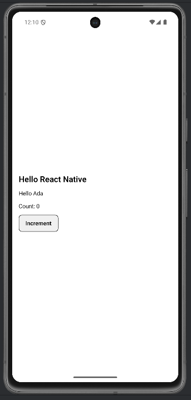

# Lab 01 – Introduzione a React Native vs React JS

## Obiettivo

- Crea la tua prima app Expo e verifica il setup end-to-end.
- Costruisci una schermata con componenti e interazione base.
- Gestisci almeno un edge case con un messaggio chiaro.

## Timebox

2h

## Prerequisiti

- PC con Node.js LTS installato
- VS Code e Git
- Expo oppure React Native CLI (Android)
- Android emulator oppure telefono reale

## Scenario

Crea una mini-app Expo con una schermata "Hello React Native". La schermata deve contenere un titolo, un componente che riceve una prop `name`, e un contatore con `Pressable`.

> **Perché questo lab:** verificare che Metro + Fast Refresh funzionino, e che sai costruire un componente con props e stato.

## Cosa imparerai

1. Come creare un progetto Expo da zero.
2. Come funziona il ciclo: salva → Fast Refresh → vedi il cambiamento.
3. Come passare dati ai componenti tramite props.
4. Come aggiungere interazione con `useState` e `Pressable`.

## Starter pattern (solo promemoria)

```tsx
import React from "react";
import { StyleSheet, Text, View } from "react-native";

function Greeting({ name }: { name: string }) {
  return <Text>Ciao {name}</Text>;
}

export default function App() {
  return (
    <View style={styles.container}>
      <Greeting name="Student" />
    </View>
  );
}

const styles = StyleSheet.create({
  container: { padding: 24 },
});
```

## Passi

1. **Crea il progetto** — Esegui `npx create-expo-app MyFirstApp --template blank-typescript` e poi `cd MyFirstApp && npx expo start`.
2. **Schermata base** — Sostituisci il contenuto di `App.tsx` con: un titolo "Hello React Native", un testo che spiega la differenza tra RN e React JS.
3. **Componente Greeting** — Crea una funzione `Greeting` che riceve `{ name: string }` e la mostra nell'UI.
4. **Aggiungi contatore** — Usa `React.useState(0)` per un contatore e un `Pressable` per incrementarlo.
5. **Aggiungi stili** — Crea un `StyleSheet.create` con spacing, font size per il titolo, bordi per il bottone.
6. **Test Fast Refresh** — Modifica una stringa, salva e verifica che l'app si aggiorni senza reload manuale.
7. **Edge case** — Se `name` è vuoto, mostra "student" come fallback.

## Screenshot attesi

**Schermata iniziale — Count: 0**



**Contatore incrementato — Count: 3**


## Consegna minima

- App che parte su emulatore o device
- UI chiara e leggibile
- Un edge case gestito con un messaggio chiaro

## Checkpoint

- [ ] Avvio progetto senza errori
- [ ] Feature completata e dimostrabile
- [ ] Edge case gestito con messaggio chiaro
- [ ] Cleanup completato

## Problemi comuni

- Se Metro non parte: chiudi processi in ascolto e riavvia `npx expo start`.
- Se l'emulatore è lento: verifica virtualizzazione/KVM/Hyper-V o usa device reale.
- Se l'app non si connette: controlla che PC e device siano sulla stessa rete (LAN).

Se la rete LAN è bloccata (VPN / Wi‑Fi isolato), prova `npx expo start --tunnel`.

## Cleanup

- Stoppa Metro bundler (CTRL+C).
- Chiudi emulator e libera risorse.
- Se hai usato permessi (camera/location): revoca i permessi dall'OS.
- Se hai usato storage locale: svuota i dati dell'app o rimuovi le chiavi salvate.

## Search terms

- npx create-expo-app
- expo start -c
- expo go cannot connect to metro
- android emulator not starting virtualization
