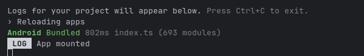

# Lab 03 – Setup ambiente: Expo, CLI, emulatori

## Obiettivo

- Setup completo e verificabile: Metro, emulator/device, logs.
- Crea una checklist riusabile per tutto il corso.
- Gestisci almeno un edge case con un messaggio chiaro.

## Timebox

2h

## Prerequisiti

- PC con Node.js LTS installato
- VS Code e Git
- Expo oppure React Native CLI (Android)
- Android emulator oppure telefono reale

## Scenario

Ogni studente deve dimostrare di poter avviare l'app, eseguire un test di interazione, e trovare i log sia nel terminale Metro sia nel device.

> **Perché questo lab:** avere una checklist di setup solida evita perdite di tempo nei lab successivi.

## Cosa imparerai

1. Come avviare un progetto Expo con `npx expo start`.
2. Quando usare `--tunnel` (rete bloccata) e `-c` (cache corrotta).
3. Dove appaiono i `console.log`: terminale Metro vs debugger device.
4. Come verificare la connessione con `adb devices`.

## Starter pattern (solo promemoria)

```tsx
import React from "react";
import { Pressable, Text, View } from "react-native";

export default function App() {
  const [status, setStatus] = React.useState("ready");

  React.useEffect(() => {
    console.log("App mounted");
  }, []);

  return (
    <View style={{ padding: 24, gap: 12 }}>
      <Text>Status: {status}</Text>
      <Pressable onPress={() => setStatus("button pressed")}>
        <Text>Test interaction</Text>
      </Pressable>
    </View>
  );
}
```

## Passi

1. **Verifica Node.js** — `node -v` deve mostrare LTS. Crea un progetto con `npx create-expo-app`.
2. **Avvia l'app** — Esegui `npx expo start` e apri su emulator o device reale.
3. **Cache** — Esegui `npx expo start -c` e spiega quando serve (bundle vecchio, errori strani).
4. **Log** — Aggiungi `console.log("App mounted")` in un `useEffect` e verifica dove appare.
5. **Tunnel** — Se la rete dà problemi, prova `npx expo start --tunnel` e annota pro/contro.
6. **Checklist** — In fondo al file, scrivi una checklist di 10 punti per il setup.

## Comandi utili

```bash
npx create-expo-app my-app --template blank-typescript
cd my-app
npx expo start
npx expo start --tunnel
npx expo start -c
adb devices
```

## Screenshot attesi

**App avviata**


**Console log**




## Consegna minima

- App che parte su emulatore o device
- UI chiara e leggibile
- Un edge case gestito con un messaggio chiaro

## Checkpoint

- [ ] Avvio progetto senza errori
- [ ] Feature completata e dimostrabile
- [ ] Edge case gestito con messaggio chiaro
- [ ] Cleanup completato

## Problemi comuni

- Se Metro non parte: chiudi processi in ascolto e riavvia `npx expo start`.
- Se l'emulatore è lento: verifica virtualizzazione/KVM/Hyper-V o usa device reale.
- Se l'app non si connette: controlla che PC e device siano sulla stessa rete (LAN).

> **Guida ADB:** vedi Cheat Sheet → §31 nel file `00_cheatsheet_react-native-programming_en.md`.

## Cleanup

- Stoppa Metro bundler (CTRL+C).
- Chiudi emulator e libera risorse.
- Se hai usato permessi (camera/location): revoca i permessi dall'OS.
- Se hai usato storage locale: svuota i dati dell'app o rimuovi le chiavi salvate.

## Search terms

- expo start --tunnel
- adb devices
- android studio avd manager
- expo go cannot connect to metro
