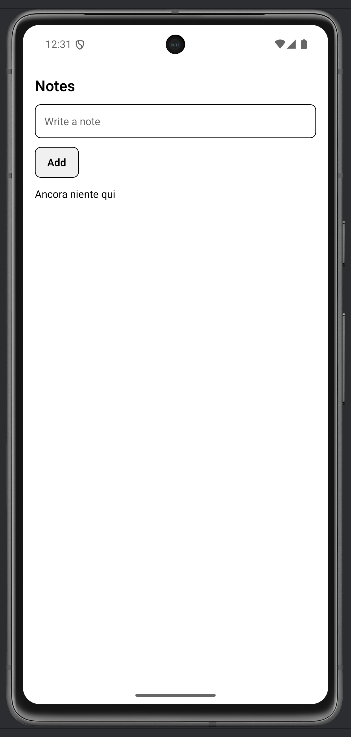
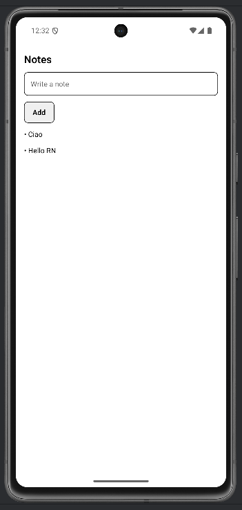

# Lab 04 – Problem solving e progettazione mobile

## Obiettivo

- Costruisci una feature con stati espliciti: loading / empty / success / error.
- Implementa un pattern retry su errore.
- Gestisci almeno un edge case con un messaggio chiaro.

## Timebox

2h

## Prerequisiti

- PC con Node.js LTS installato
- VS Code e Git
- Expo oppure React Native CLI (Android)
- Android emulator oppure telefono reale

## Scenario

Realizza una mini app "Notes" con un input per aggiungere note e una lista per mostrarle. La UI deve avere stati chiari e un pulsante "Riprova" in caso di errore.

> **Perché questo lab:** esercitare il pattern "definisci gli stati prima, poi costruisci la UI sopra". Questo approccio evita bug legati a stati incoerenti.

## Cosa imparerai

1. Come definire gli stati di una schermata **prima** di scrivere la UI.
2. Come usare `setTimeout` per simulare un caricamento.
3. Come gestire lo stato `error` con un'azione (retry).
4. Come rendere ogni stato visibile all'utente.

## Starter pattern (solo promemoria)

```tsx
const [status, setStatus] = React.useState("loading");

if (status === "loading") return <Text>Caricamento...</Text>;
if (status === "error") return <Text>Caricamento fallito</Text>;
if (status === "empty") return <Text>Ancora niente qui</Text>;
return <Text>Pronto</Text>;
```

## Passi

1. **Avvia progetto Expo** — verifica che l'app parta.
2. **Definisci gli stati** — Scrivi su carta o nel README: empty, loading, success, error.
3. **Implementa `load()`** — Una funzione che imposta "loading", attende 300ms, poi mostra i dati o "empty".
4. **Aggiungi input** — Un `TextInput` + pulsante "Add" per aggiungere note alla lista.
5. **Edge case** — Lo stato `error` deve avere un pulsante "Riprova" che richiama `load()`.
6. **Test manuale** — Forza ogni stato e verifica che la UI sia corretta.

## Manual test checklist

Prima della consegna, forza questi stati:

- **Loading:** inserisci un delay per vedere il loader
- **Empty:** non aggiungere note e verifica il messaggio
- **Error:** fai `throw new Error()` e verifica il retry
- **Success:** aggiungi note e verificale in lista

## Screenshot attesi

**Stato empty**



**Stato success con note**


**Stato success con note**




## Consegna minima

- App che parte su emulatore o device
- UI chiara e leggibile
- Un edge case gestito con un messaggio chiaro

## Checkpoint

- [ ] Avvio progetto senza errori
- [ ] Feature completata e dimostrabile
- [ ] Edge case gestito con messaggio chiaro
- [ ] Cleanup completato

## Problemi comuni

- Se Metro non parte: chiudi processi in ascolto e riavvia `npx expo start`.
- Se l'emulatore è lento: verifica virtualizzazione/KVM/Hyper-V o usa device reale.
- Se l'app non si connette: controlla che PC e device siano sulla stessa rete (LAN).

## Cleanup

- Stoppa Metro bundler (CTRL+C).
- Chiudi emulator e libera risorse.
- Se hai usato permessi (camera/location): revoca i permessi dall'OS.
- Se hai usato storage locale: svuota i dati dell'app o rimuovi le chiavi salvate.

## Search terms

- expo start android emulator
- react native usestate loading error
- react native retry pattern
