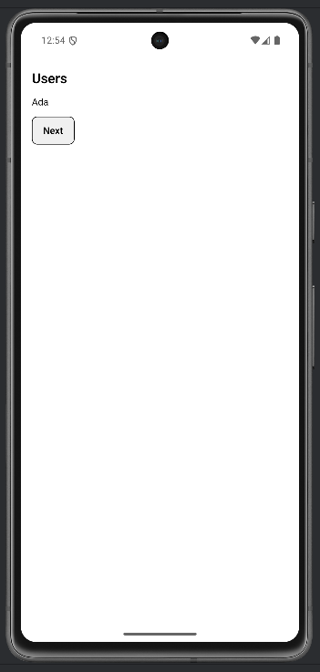
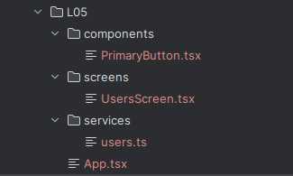

# Lab 05 – Architettura modulare in React Native

## Obiettivo

- Refactora una mini-app in struttura modulare: screens / components / services.
- Crea almeno 1 componente riusabile e 1 servizio.
- Gestisci almeno un edge case con un messaggio chiaro.

## Timebox

2h

## Prerequisiti

- PC con Node.js LTS installato
- VS Code e Git
- Expo oppure React Native CLI (Android)
- Android emulator oppure telefono reale

## Scenario

Prendi l'app Notes del lab 04 (o un'app simile) e **spezzala** in file separati con una struttura chiara.

> **Perché questo lab:** in un progetto reale, tutto in App.tsx diventa illeggibile. Imparare ora la separazione in cartelle evita refactoring costosi dopo.

## Cosa imparerai

1. La struttura `screens/` → `components/` → `services/`.
2. La regola degli import: screens importano tutto, services non importano UI.
3. Come creare un componente riusabile con props callback (`onPress`).
4. Come esportare da un barrel file (`index.tsx`).

## File da creare

```
services/users.ts
components/PrimaryButton.tsx
screens/UsersScreen.tsx
App.tsx
```

## Starter pattern (solo promemoria)

```tsx
// components/PrimaryButton.tsx
import { Pressable, Text } from "react-native";

export function PrimaryButton(
  { label, onPress }: { label: string; onPress: () => void }
) {
  return (
    <Pressable onPress={onPress} style={{ padding: 12, borderWidth: 1, borderRadius: 8 }}>
      <Text style={{ fontWeight: "600" }}>{label}</Text>
    </Pressable>
  );
}
```

## Passi

1. **Crea le cartelle** — `screens/`, `components/`, `services/`.
2. **services/users.ts** — Esporta una funzione `getUsers()` che ritorna `["Ada", "Grace"]`.
3. **components/PrimaryButton.tsx** — Componente con props `label` e `onPress`.
4. **screens/UsersScreen.tsx** — Screen che chiama `getUsers()` in un `useEffect` e mostra il primo utente.
5. **App.tsx** — Importa e renderizza `<UsersScreen />`.
6. **Verifica import** — screens → components + services, mai il contrario.
7. **Edge case** — Se la lista utenti è vuota, mostra "Nessun utente ancora".

## Barrel export (opzionale)

```ts
// features/notes/index.tsx
export { NotesScreen } from "./screens/NotesScreen";
export { addNote, listNotes } from "./services/notes";
```

## Screenshot attesi

**Schermata utenti — primo utente (Ada)**



**Dopo pressione Next — secondo utente (Grace)**


**Struttura cartelle — components / screens / services**




## Consegna minima

- App che parte su emulatore o device
- UI chiara e leggibile
- Un edge case gestito con un messaggio chiaro

## Checkpoint

- [ ] Avvio progetto senza errori
- [ ] Feature completata e dimostrabile
- [ ] Edge case gestito con messaggio chiaro
- [ ] Cleanup completato

## Problemi comuni

- Se Metro non parte: chiudi processi in ascolto e riavvia `npx expo start`.
- Se l'emulatore è lento: verifica virtualizzazione/KVM/Hyper-V o usa device reale.
- Se l'app non si connette: controlla che PC e device siano sulla stessa rete (LAN).

## Cleanup

- Stoppa Metro bundler (CTRL+C).
- Chiudi emulator e libera risorse.
- Se hai usato permessi (camera/location): revoca i permessi dall'OS.
- Se hai usato storage locale: svuota i dati dell'app o rimuovi le chiavi salvate.

## Search terms

- react native project structure
- barrel exports typescript
- react native screens components services
