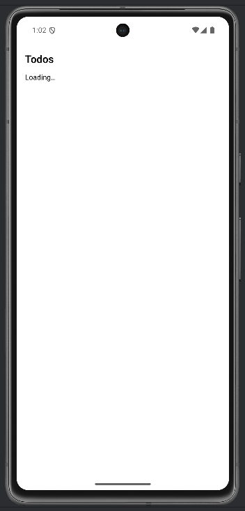
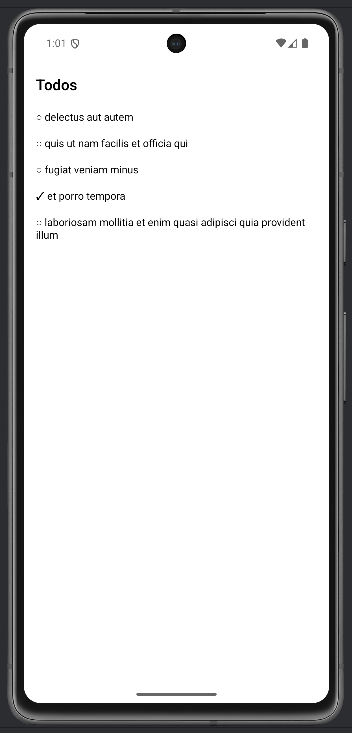
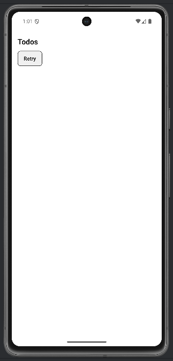

# Lab 06 – Librerie core e terze parti, dipendenze e versioning

## Obiettivo

- Implementa una feature di rete con `fetch` (o Axios).
- Gestisci errori HTTP esplicitamente.
- Gestisci almeno un edge case con un messaggio chiaro.

## Timebox

2h

## Prerequisiti

- PC con Node.js LTS installato
- VS Code e Git
- Expo oppure React Native CLI (Android)
- Android emulator oppure telefono reale

## Scenario

Carica una lista di todos da `https://jsonplaceholder.typicode.com/todos?_limit=5` e mostrala con `FlatList`. Gestisci loading, error e success.

> **Perché questo lab:** capire la differenza tra usare solo `fetch` (zero dipendenze) e aggiungere Axios (più comodo ma +1 dipendenza). In produzione questa scelta ha impatto su bundle size e manutenibilità.

## Cosa imparerai

1. Come usare `fetch` con controllo `res.ok` per errori HTTP.
2. Come gestire una lista di dati con `FlatList`.
3. Come scegliere tra libreria core e terza parte.
4. Come documentare le dipendenze nel README.

## Starter pattern (solo promemoria)

```tsx
async function fetchTodos() {
  const res = await fetch(
    "https://jsonplaceholder.typicode.com/todos?_limit=5"
  );
  if (!res.ok) throw new Error("Request failed");
  return res.json();
}
```

## Passi

1. **Avvia progetto Expo** — verifica che l'app parta.
2. **Funzione fetch** — Crea `fetchTodos()` che carica i dati e controlla `res.ok`.
3. **Mostra la lista** — Usa `FlatList` con `keyExtractor` per mostrare i todos.
4. **3 stati UI** — `loading` (testo), `error` (pulsante Retry), `success` (lista).
5. **Edge case** — Simula un errore (URL sbagliata) e mostra il messaggio di errore con Retry.
6. **README** — Documenta: cosa hai scelto (fetch o Axios), perché, nota su lockfile.

## Screenshot attesi

**Lista todos**



**Lista todos**



**Stato errore**




## Consegna minima

- App che parte su emulatore o device
- UI chiara e leggibile
- Un edge case gestito con un messaggio chiaro

- `README.md` aggiornato con motivazione (core vs third-party)

## Checkpoint

- [ ] Avvio progetto senza errori
- [ ] Feature completata e dimostrabile
- [ ] Edge case gestito con messaggio chiaro
- [ ] Cleanup completato

## Problemi comuni

- Se Metro non parte: chiudi processi in ascolto e riavvia `npx expo start`.
- Se l'emulatore è lento: verifica virtualizzazione/KVM/Hyper-V o usa device reale.
- Se l'app non si connette: controlla che PC e device siano sulla stessa rete (LAN).

## Cleanup

- Stoppa Metro bundler (CTRL+C).
- Chiudi emulator e libera risorse.
- Se hai usato permessi (camera/location): revoca i permessi dall'OS.
- Se hai usato storage locale: svuota i dati dell'app o rimuovi le chiavi salvate.

## Search terms

- fetch api react native
- axios vs fetch react native
- jsonplaceholder api
