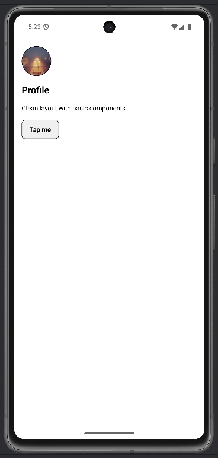
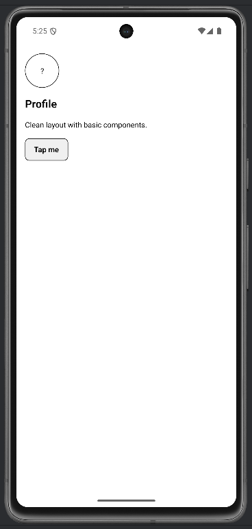

# Lab 07 – Componenti base React Native (Parte 1)

## Obiettivo

- Costruisci una schermata usando `View`, `Text`, `Image`, `ScrollView`, `Pressable`.
- Implementa un fallback per immagini mancanti.
- Gestisci almeno un edge case con un messaggio chiaro.

## Timebox

2h

## Prerequisiti

- PC con Node.js LTS installato
- VS Code e Git
- Expo oppure React Native CLI (Android)
- Android emulator oppure telefono reale

## Scenario

Realizza una schermata "Profile + Highlights": un header con avatar e nome, una card con contenuti, un bottone interattivo.

> **Perché questo lab:** conoscere i componenti primitivi è la base. Ogni schermata che costruirai userà `View`, `Text`, `Image`, `Pressable`.

## Cosa imparerai

1. Come comporre la UI con `View` (contenitore), `Text` (testo), `Image` (immagini).
2. Come usare `ScrollView` per contenuti che possono overflow.
3. Come gestire immagini mancanti con `onError` e fallback.
4. Come dare feedback visivo con `Pressable` e `pressed` state.

## Starter pattern (solo promemoria)

```tsx
import { Image, Pressable, Text, View } from "react-native";

<View style={{ padding: 16, gap: 12 }}>
  <Text style={{ fontSize: 20, fontWeight: "600" }}>Title</Text>
  <Image
    source={{ uri: "https://picsum.photos/200" }}
    style={{ width: 200, height: 120, borderRadius: 12 }}
  />
  <Pressable onPress={() => {}} style={{ padding: 10, borderWidth: 1, borderRadius: 8 }}>
    <Text style={{ fontWeight: "600" }}>Tap</Text>
  </Pressable>
</View>
```

## Passi

1. **Avvia progetto Expo** — verifica che l'app parta.
2. **Header** — Crea un layout orizzontale (`flexDirection: "row"`) con un avatar `Image` e un testo.
3. **Card** — Una `View` con bordi, padding e contenuti testuali.
4. **Bottone** — Un `Pressable` con feedback `opacity: 0.6` quando premuto.
5. **Fallback immagine** — Se l'URL è sbagliato, mostra un `?` al posto dell'immagine usando `onError`.
6. **ScrollView** — Wrappa tutto in `ScrollView` per gestire overflow.

## Screenshot attesi

**Profilo con avatar**



**Fallback immagine**




## Consegna minima

- App che parte su emulatore o device
- UI chiara e leggibile
- Un edge case gestito con un messaggio chiaro

## Checkpoint

- [ ] Avvio progetto senza errori
- [ ] Feature completata e dimostrabile
- [ ] Edge case gestito con messaggio chiaro
- [ ] Cleanup completato

## Problemi comuni

- Se Metro non parte: chiudi processi in ascolto e riavvia `npx expo start`.
- Se l'emulatore è lento: verifica virtualizzazione/KVM/Hyper-V o usa device reale.
- Se l'app non si connette: controlla che PC e device siano sulla stessa rete (LAN).

## Cleanup

- Stoppa Metro bundler (CTRL+C).
- Chiudi emulator e libera risorse.
- Se hai usato permessi (camera/location): revoca i permessi dall'OS.
- Se hai usato storage locale: svuota i dati dell'app o rimuovi le chiavi salvate.

## Search terms

- react native image onError fallback
- react native scrollview vs flatlist
- pressable pressed state react native
