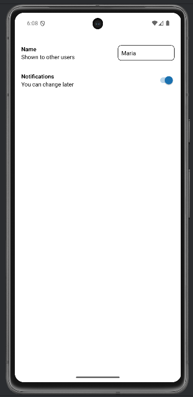
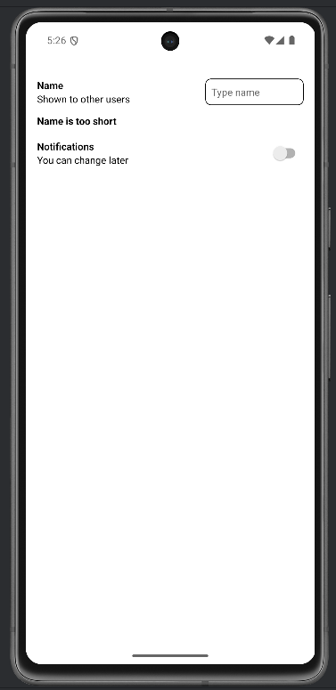

# Lab 08 – Props, eventi e binding (Componenti base Parte 2)

## Obiettivo

- Crea componenti riusabili con props e callback.
- Collega `TextInput` e `Switch` allo stato.
- Gestisci almeno un edge case con un messaggio chiaro.

## Timebox

2h

## Prerequisiti

- PC con Node.js LTS installato
- VS Code e Git
- Expo oppure React Native CLI (Android)
- Android emulator oppure telefono reale

## Scenario

Costruisci una mini schermata "Settings" con righe riusabili. Ogni riga ha un label, una descrizione ed un elemento a destra (`TextInput` o `Switch`).

> **Perché questo lab:** il pattern "data down, events up" è la base di React. I componenti figli non decidono cosa fare, chiamano callback passate dal genitore.

## Cosa imparerai

1. Come creare un componente con props `label`, `value`, `right` (ReactNode).
2. Come collegare `TextInput` con `value` + `onChangeText`.
3. Come collegare `Switch` con `value` + `onValueChange`.
4. Il pattern "data down, events up" in pratica.

## File da creare

```
components/SettingRow.tsx
App.tsx
```

## Starter pattern (solo promemoria)

```tsx
function SettingRow(
  { label, value, onPress }: { label: string; value: string; onPress: () => void }
) {
  return (
    <Pressable onPress={onPress} style={{ padding: 12, borderWidth: 1, borderRadius: 12 }}>
      <Text style={{ fontWeight: "600" }}>{label}</Text>
      <Text>{value}</Text>
    </Pressable>
  );
}
```

## Passi

1. **Avvia progetto Expo** — verifica che l'app parta.
2. **SettingRow** — Crea `components/SettingRow.tsx` con props: `label`, `value`, `right` (ReactNode).
3. **Riga con TextInput** — Usa SettingRow con un `TextInput` nel slot `right`.
4. **Riga con Switch** — Usa SettingRow con un `Switch` nel slot `right`.
5. **Validazione** — Se il nome è troppo corto (< 2 caratteri), mostra "Name is too short".
6. **Demo** — Spiega in 3 frasi: "i dati scendono via props, gli eventi risalgono via callback".

## Screenshot attesi

**Settings screen**



**Validazione nome**




## Consegna minima

- App che parte su emulatore o device
- UI chiara e leggibile
- Un edge case gestito con un messaggio chiaro

- Almeno 1 componente riutilizzabile con props

## Checkpoint

- [ ] Avvio progetto senza errori
- [ ] Feature completata e dimostrabile
- [ ] Edge case gestito con messaggio chiaro
- [ ] Cleanup completato

## Problemi comuni

- Se Metro non parte: chiudi processi in ascolto e riavvia `npx expo start`.
- Se l'emulatore è lento: verifica virtualizzazione/KVM/Hyper-V o usa device reale.
- Se l'app non si connette: controlla che PC e device siano sulla stessa rete (LAN).

## Cleanup

- Stoppa Metro bundler (CTRL+C).
- Chiudi emulator e libera risorse.
- Se hai usato permessi (camera/location): revoca i permessi dall'OS.
- Se hai usato storage locale: svuota i dati dell'app o rimuovi le chiavi salvate.

## Search terms

- react native props callback
- react native switch component
- data down events up react
