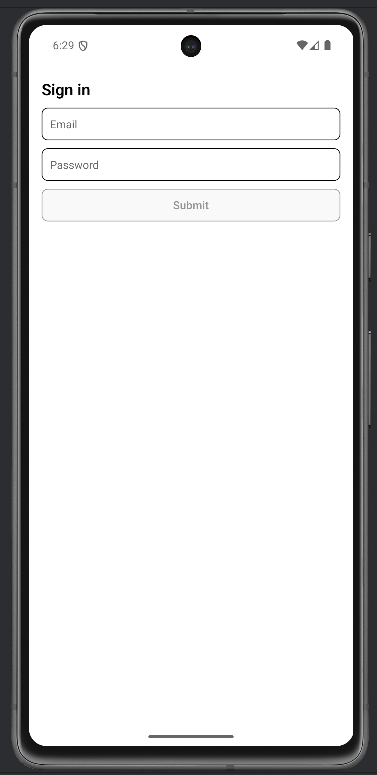

# Lab 09 – Stato con useState e componenti controllati

## Obiettivo

- Costruisci un form controllato con `useState`.
- Implementa validazione derivata (senza stato duplicato).
- Gestisci almeno un edge case con un messaggio chiaro.

## Timebox

2h

## Prerequisiti

- PC con Node.js LTS installato
- VS Code e Git
- Expo oppure React Native CLI (Android)
- Android emulator oppure telefono reale

## Scenario

Costruisci un mini form "Sign in" con campi email e password. Ogni campo è controllato da `useState`, la validazione è derivata dallo stato.

> **Perché questo lab:** i controlled components sono il modo standard di gestire form in React/RN. Lo stato è la "single source of truth" e la UI riflette lo stato.

## Cosa imparerai

1. Come collegare `TextInput` → `useState` (`value` + `onChangeText`).
2. Come derivare la validazione dallo stato (no stato extra per "isValid").
3. Perché `setCount((prev) => prev + 1)` è più sicuro di `setCount(count + 1)`.
4. Come mostrare errori solo dopo il submit (pattern `submitted`).

## Starter pattern (solo promemoria)

```tsx
const [email, setEmail] = React.useState("");
const emailOk = email.includes("@");

<TextInput value={email} onChangeText={setEmail} placeholder="Email" />
<Text>{emailOk ? "OK" : "Too short"}</Text>
```

## Passi

1. **Avvia progetto Expo** — verifica che l'app parta.
2. **Crea il form** — Due `TextInput`: email e password, ciascuno con il proprio `useState`.
3. **Validazione derivata** — `emailOk = email.includes("@")`, `passwordOk = password.length >= 6`.
4. **Submit** — Un `Pressable` che imposta `setSubmitted(true)`.
5. **Errori condizionali** — Mostra gli errori solo se `submitted && !emailOk`.
6. **Edge case** — Pulsante con opacity ridotta se il form non è valido.

## Screenshot attesi

**Form vuoto — stato iniziale, nessun errore visibile**



**Errori dopo submit — validazione con messaggi inline**


## Consegna minima

- App che parte su emulatore o device
- UI chiara e leggibile
- Un edge case gestito con un messaggio chiaro

## Checkpoint

- [ ] Avvio progetto senza errori
- [ ] Feature completata e dimostrabile
- [ ] Edge case gestito con messaggio chiaro
- [ ] Cleanup completato

## Problemi comuni

- Se Metro non parte: chiudi processi in ascolto e riavvia `npx expo start`.
- Se l'emulatore è lento: verifica virtualizzazione/KVM/Hyper-V o usa device reale.
- Se l'app non si connette: controlla che PC e device siano sulla stessa rete (LAN).

## Cleanup

- Stoppa Metro bundler (CTRL+C).
- Chiudi emulator e libera risorse.
- Se hai usato permessi (camera/location): revoca i permessi dall'OS.
- Se hai usato storage locale: svuota i dati dell'app o rimuovi le chiavi salvate.

## Search terms

- react native textinput controlled
- usestate form validation react native
- controlled vs uncontrolled input
