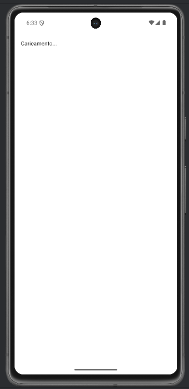
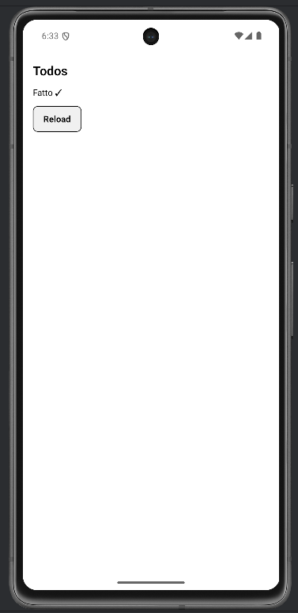
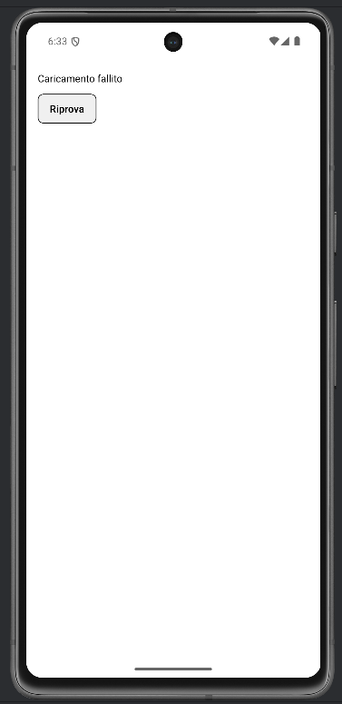

# Lab 10 – useEffect, effetti asincroni e cleanup

## Obiettivo

- Usa `useEffect` con timer e funzione di cleanup.
- Mostra stati espliciti: loading → success / error.
- Gestisci almeno un edge case con un messaggio chiaro.

## Timebox

2h

## Prerequisiti

- PC con Node.js LTS installato
- VS Code e Git
- Expo oppure React Native CLI (Android)
- Android emulator oppure telefono reale

## Scenario

Costruisci una schermata che simula il caricamento dati con `setTimeout` dentro `useEffect`. Implementa un cleanup con `clearTimeout` e un pulsante "Riprova" per simulare l'errore.

> **Perché questo lab:** `useEffect` è il hook per gli effetti collaterali (fetch, timer, listener). Il cleanup evita memory leak.

## Cosa imparerai

1. Come funziona `useEffect(() => { ... return cleanup }, [])`.
2. Perché il cleanup è importante (evita aggiornamenti su componenti smontati).
3. Come simulare loading con `setTimeout`.
4. Come gestire loading / success / error in modo esplicito.

## Starter pattern (solo promemoria)

```tsx
React.useEffect(() => {
  const id = setTimeout(() => {
    setStatus("success");
  }, 1000);

  return () => clearTimeout(id);
}, []);
```

## Passi

1. **Avvia progetto Expo** — verifica che l'app parta.
2. **useEffect con timer** — Al mount, imposta "loading". Dopo 1s, "success". Ritorna `clearTimeout`.
3. **Schermata condizionale** — `if (status === "loading") return <Text>Caricamento...</Text>`.
4. **Pulsante Retry** — Imposta "loading" e dopo 1s "error", per simulare un fallimento.
5. **Pulsante Reload** — Richiama la funzione di caricamento.
6. **Edge case** — Verifica che il cleanup cancella il timer.

## Screenshot attesi

**Stato loading — timer in corso con useEffect**



**Stato success — dati caricati dopo il timer**



**Stato error — caricamento fallito**



## Consegna minima

- App che parte su emulatore o device
- UI chiara e leggibile
- Un edge case gestito con un messaggio chiaro

## Checkpoint

- [ ] Avvio progetto senza errori
- [ ] Feature completata e dimostrabile
- [ ] Edge case gestito con messaggio chiaro
- [ ] Cleanup completato

## Problemi comuni

- Se Metro non parte: chiudi processi in ascolto e riavvia `npx expo start`.
- Se l'emulatore è lento: verifica virtualizzazione/KVM/Hyper-V o usa device reale.
- Se l'app non si connette: controlla che PC e device siano sulla stessa rete (LAN).

## Cleanup

- Stoppa Metro bundler (CTRL+C).
- Chiudi emulator e libera risorse.
- Se hai usato permessi (camera/location): revoca i permessi dall'OS.
- Se hai usato storage locale: svuota i dati dell'app o rimuovi le chiavi salvate.

## Search terms

- useeffect cleanup react native
- settimeout useeffect react
- react native loading state pattern
