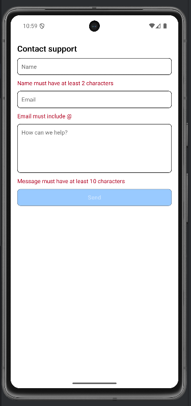
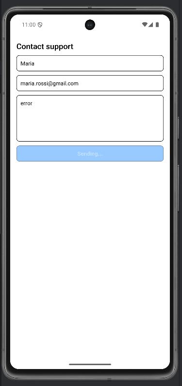
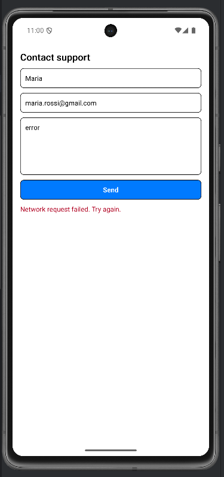
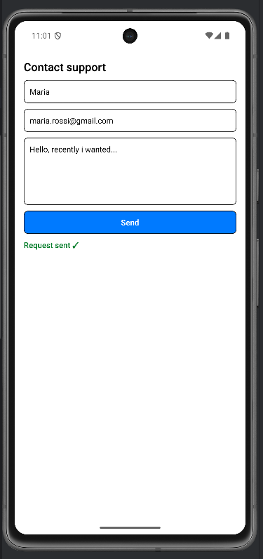

# Lab 11 – Form in mobile: form controllati e pattern

## Obiettivo

- Form mobile completo con validazione e stati di submit espliciti.
- Gestisci tastiera e layout su schermi piccoli.
- Gestisci almeno un edge case con un messaggio chiaro.

## Timebox

2h

## Prerequisiti

- PC con Node.js LTS installato
- VS Code e Git
- Expo oppure React Native CLI (Android)
- Android emulator oppure telefono reale

## Scenario

Costruisci un form mobile "Contact support": name, email e message, validazione, submit con `loading/error/success`, layout che resta usabile quando compare la tastiera.

> **Perché questo lab:** dopo l'introduzione del lab 09, qui aggiungi i veri pattern dei form mobile: tastiera, submit disabilitato durante l'invio e feedback esplicito per successo o errore.

## Cosa imparerai

1. Il pattern completo: `useState` → validazione derivata → submit → `loading/error/success`.
2. Come usare `KeyboardAvoidingView` + `ScrollView` per i form mobile.
3. Come usare `opacity` per comunicare che il form non e pronto, ma disabilitare il `Pressable` solo durante `loading`.
4. Come simulare un submit async senza introdurre librerie esterne.

## Starter pattern (solo promemoria)

```tsx
const shouldSimulateError = message.trim().toLowerCase().includes("error");
const messageOk = message.trim().length >= 10 || shouldSimulateError;
const canSubmit = nameOk && emailOk && messageOk;
const isSending = status === "loading";

<Pressable
  onPress={onSubmit}
  disabled={isSending}
  style={{
    opacity: canSubmit && !isSending ? 1 : 0.4,
    padding: 14,
    borderRadius: 8,
    backgroundColor: "#007AFF",
  }}
>
  <Text style={{ color: "#fff", textAlign: "center" }}>
    {status === "loading" ? "Sending..." : "Send"}
  </Text>
</Pressable>;
```

## Passi

1. **Avvia progetto Expo** — verifica che l'app parta.
2. **Layout mobile** — Usa `KeyboardAvoidingView` e `ScrollView` così i campi restano visibili con la tastiera aperta.
3. **Tre campi controllati** — Name, Email (`autoCapitalize: "none"`) e Message (`multiline`).
4. **Validazione** — `nameOk = name.trim().length >= 2`, `emailOk = email.includes("@")`, `messageOk = message.trim().length >= 10`.
5. **Submit** — `setSubmitted(true)`, poi se valido passa a `loading`.
6. **Stati espliciti** — Dopo un `setTimeout`, mostra `success` oppure `error`.
7. **Failure state testabile** — Se il messaggio contiene la parola `error`, simula un errore di rete anche con un testo corto, cosi il failure state e facile da provare.
8. **Bottone styled** — Colore `#007AFF`, testo bianco, opacity ridotta quando il form non e pronto, ma `disabled` solo durante `loading` cosi il primo tap puo mostrare gli errori.

## Screenshot attesi

**Form mobile — campi controllati con layout sicuro per tastiera**


**Submit state — feedback di errore o successo dopo invio**







## Consegna minima

- App che parte su emulatore o device
- UI chiara e leggibile
- Un edge case gestito con un messaggio chiaro

## Checkpoint

- [ ] Avvio progetto senza errori
- [ ] Feature completata e dimostrabile
- [ ] Edge case gestito con messaggio chiaro
- [ ] Cleanup completato

## Problemi comuni

- Se Metro non parte: chiudi processi in ascolto e riavvia `npx expo start`.
- Se l'emulatore è lento: verifica virtualizzazione/KVM/Hyper-V o usa device reale.
- Se l'app non si connette: controlla che PC e device siano sulla stessa rete (LAN).

## Cleanup

- Stoppa Metro bundler (CTRL+C).
- Chiudi emulator e libera risorse.
- Se hai usato permessi (camera/location): revoca i permessi dall'OS.
- Se hai usato storage locale: svuota i dati dell'app o rimuovi le chiavi salvate.

## Search terms

- react native keyboardavoidingview form
- react native scrollview keyboardshouldpersisttaps
- react native submit loading error success
