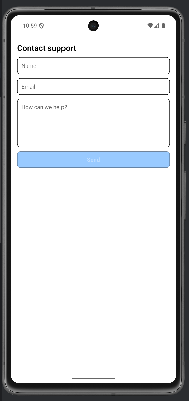

# Lab 11 – Form in mobile: form controllati e pattern

## Obiettivo

- Form controllato completo con validazione.
- Bottone Submit disabilitato se non valido.
- Gestisci almeno un edge case con un messaggio chiaro.

## Timebox

2h

## Prerequisiti

- PC con Node.js LTS installato
- VS Code e Git
- Expo oppure React Native CLI (Android)
- Android emulator oppure telefono reale

## Scenario

Costruisci un form "Sign in" completo: email + password, validazione, submitted state, pulsante styled.

> **Perché questo lab:** consolidare il pattern form controllato con bottone disabilitato — è il form pattern usato nel 90% delle app reali.

## Cosa imparerai

1. Il pattern completo: `useState` → validazione derivata → submit → mostra errori.
2. Come disabilitare un `Pressable` con `disabled` e `opacity`.
3. Come usare `secureTextEntry` per le password.
4. Come dare feedback visivo con colori (`backgroundColor: "#007AFF"`).

## Starter pattern (solo promemoria)

```tsx
const emailOk = email.includes("@");
const passwordOk = password.length >= 8;
const canSubmit = emailOk && passwordOk;

<Pressable
  onPress={handleSubmit}
  disabled={!canSubmit}
  style={{ opacity: canSubmit ? 1 : 0.4, padding: 14, borderRadius: 8, backgroundColor: "#007AFF" }}
>
  <Text style={{ color: "#fff", textAlign: "center" }}>Submit</Text>
</Pressable>
```

## Passi

1. **Avvia progetto Expo** — verifica che l'app parta.
2. **Due campi** — Email (`autoCapitalize: "none"`) e Password (`secureTextEntry`).
3. **Validazione** — `emailOk = email.includes("@")`, `passwordOk = password.length >= 8`.
4. **Submit** — `setSubmitted(true)`. Errori visibili solo dopo submit.
5. **Bottone styled** — Colore `#007AFF`, testo bianco, opacity 0.4 se non valido.
6. **Successo** — Mostra "Pronto ✓" dopo submit valido.

## Screenshot attesi

**Form controllato — campi vuoti, pulsante disabilitato**



**Errori di validazione — messaggi mostrati dopo submit**


## Consegna minima

- App che parte su emulatore o device
- UI chiara e leggibile
- Un edge case gestito con un messaggio chiaro

## Checkpoint

- [ ] Avvio progetto senza errori
- [ ] Feature completata e dimostrabile
- [ ] Edge case gestito con messaggio chiaro
- [ ] Cleanup completato

## Problemi comuni

- Se Metro non parte: chiudi processi in ascolto e riavvia `npx expo start`.
- Se l'emulatore è lento: verifica virtualizzazione/KVM/Hyper-V o usa device reale.
- Se l'app non si connette: controlla che PC e device siano sulla stessa rete (LAN).

## Cleanup

- Stoppa Metro bundler (CTRL+C).
- Chiudi emulator e libera risorse.
- Se hai usato permessi (camera/location): revoca i permessi dall'OS.
- Se hai usato storage locale: svuota i dati dell'app o rimuovi le chiavi salvate.

## Search terms

- react native form validation pattern
- pressable disabled opacity react native
- secureTextEntry react native
