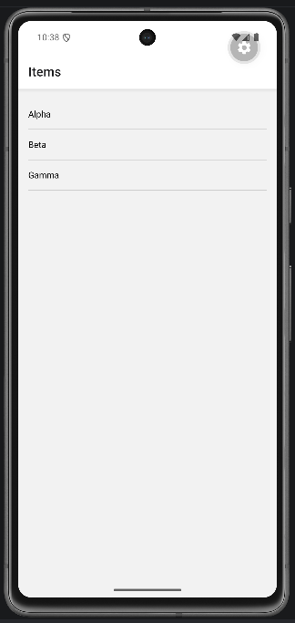
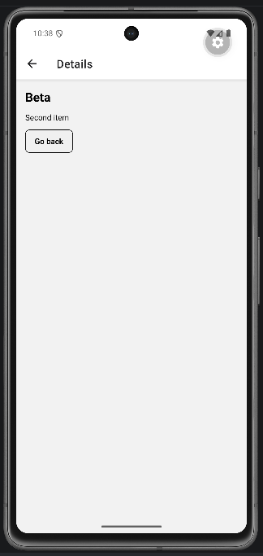
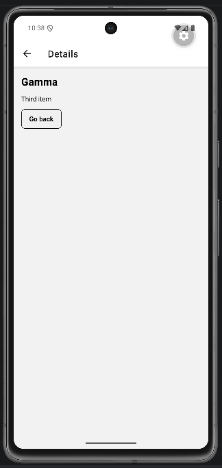

# Lab 13 - React Navigation: setup e route params

## Obiettivo

- Setup `NavigationContainer` + `createNativeStackNavigator`.
- Lista con `FlatList` → navigazione a dettaglio con `id` validato.
- Gestisci almeno un edge case con un messaggio chiaro.

## Timebox

2h 30m

## Prerequisiti

- PC con Node.js LTS installato
- VS Code e Git
- Expo oppure React Native CLI (Android)
- Android emulator oppure telefono reale

## Scenario

Setup stack navigation (Home → Details) e navigazione dinamica da lista con parametri di route validati come input non affidabile.

> **Perché questo lab:** esercitare i pattern della lezione 13 in una mini-app concreta.

## Cosa imparerai

1. Come installare React Navigation con Expo.
2. Come creare un `Stack.Navigator` con due screen.
3. Come navigare con `navigation.navigate("Details", { id: item.id })`.
4. Come validare `route.params?.id` e gestire item non trovato.

## Dipendenze (Expo)

```bash
npx expo install @react-navigation/native @react-navigation/native-stack react-native-screens react-native-safe-area-context
```

## Passi

1. **Installa dipendenze** - Esegui i comandi di installazione sopra.
2. **App.tsx** - Crea `NavigationContainer` con `Stack.Navigator` e due screen: Home e Details.
3. **HomeScreen** - `FlatList` con 3 items. Ogni riga naviga a Details con l'`id`.
4. **DetailsScreen** - Legge `route.params?.id`, cerca l'item nel dataset.
5. **Fallback** - Se `id` manca → "Invalid route param". Se item non esiste → "Product not found".
6. **Go back** - Pulsante per tornare.

## Screenshot attesi

**Lista items - FlatList con navigazione a dettaglio**



**Dettaglio item - parametro id passato via route params**






## Consegna minima

- App che parte su emulatore o device
- UI chiara e leggibile
- Edge case gestiti: id mancante e item non trovato

## Checkpoint

- [ ] Avvio progetto senza errori
- [ ] Home → Details → Back funziona
- [ ] Lista → dettaglio con id valido
- [ ] Edge case gestito con messaggio chiaro
- [ ] Cleanup completato

## Problemi comuni

- Se Metro non parte: chiudi processi in ascolto e riavvia `npx expo start`.
- Se l'emulatore è lento: verifica virtualizzazione/KVM/Hyper-V o usa device reale.
- Se l'app non si connette: controlla che PC e device siano sulla stessa rete (LAN).

## Cleanup

- Stoppa Metro bundler (CTRL+C).
- Chiudi emulator e libera risorse.

## Search terms

- react navigation expo setup
- stack navigator react native
- navigation.navigate params
- react navigation route params
