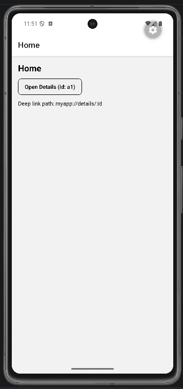

# Lab 14 - Navigazione avanzata e deep linking

## Obiettivo

- Configurazione deep linking con `linking` object.
- Gestisci almeno un edge case con un messaggio chiaro.

## Timebox

2h

## Prerequisiti

- PC con Node.js LTS installato
- VS Code e Git
- Expo oppure React Native CLI (Android)
- Android emulator oppure telefono reale

> **Riferimento completo deep linking:** Cheat Sheet → [§26 — Deep linking](00_cheatsheet_react-native-programming_en.md#26--deep-linking) (`00_cheatsheet_react-native-programming_en.md`). Include URL `exp://`, due terminali, errori comuni e screenshot.

## Due terminali - emulatore + Metro + deep link

Per questo lab servono **due terminali** aperti insieme. Metro **blocca** il terminale: non lanciare `expo start` e `uri-scheme open` nello stesso terminale.

| Terminale                    | Cosa fai                                                                                                                                                                           |
| ---------------------------- | ---------------------------------------------------------------------------------------------------------------------------------------------------------------------------------- |
| **1 - Emulatore e test URL** | Avvia l'AVD da Android Studio (**Virtual Device Manager** → ▶). Verifica `adb devices`. Quando l'app è in esecuzione in **Expo Go**, lancia qui il deep link (vedi comando sotto). |
| **2 - Progetto (Metro)**     | `cd MyFirstApp` → `npx expo start` → premi **`a`** e attendi la **Home** sull'emulatore. **Lascia questo terminale aperto.**                                                       |

### Comando di test (Expo Go - emulatore Android)

Con Metro ancora in esecuzione nel **terminale 2**:

```bash
npx uri-scheme open "exp://10.0.2.2:8081/--/details/a1" --android
```

- **`10.0.2.2`** = IP del tuo PC visto dall'emulatore Android (non usare `127.0.0.1`).
- Su **telefono fisico** (stessa Wi‑Fi): sostituisci con l'IP del PC che vedi nel terminale Metro (es. `exp://192.168.1.6:8081/--/details/a1`).
- Il path deve essere **`details/a1`** (inglese) - non `dettagli/a1`.

> **`myapp://details/a1` non funziona con Expo Go** — solo con dev build (`npx expo run:android`). Per il corso usiamo **`exp://...`**. Dettagli, tabelle HOST e troubleshooting: [Cheat Sheet §26](00_cheatsheet_react-native-programming_en.md#26--deep-linking).

Ordine consigliato:

1. Terminale 1 → emulatore acceso, `adb devices` ok
2. Terminale 2 → `npx expo start` → premi `a` → Home visibile in Expo Go
3. Terminale 1 → comando `exp://10.0.2.2:8081/--/details/a1` → Details con `id: a1`

Se Expo non trova il device: terminale 1, `adb devices` - se vuoto, riavvia l'emulatore.

## Scenario

Configurazione deep linking con `linking` object. Validazione parametro da URL. Test con `npx uri-scheme open` e URL **`exp://`** (Expo Go).

> **Perché questo lab:** esercitare i pattern della lezione 14 in una mini-app concreta.

## Cosa imparerai

1. Come creare un `linking` config con `prefixes` (`Linking.createURL("/")` + opzionale `myapp://`) e `config.screens`.
2. Come testare deep link con `npx uri-scheme open` e URL **`exp://`** su Expo Go (opzionale: test web nel browser).
3. Come validare parametri ricevuti da deep link.
4. Perché i parametri da URL sono "unreliable input".

## Passi

1. **Installa dipendenze** - React Navigation (se non già presente) e `npx expo install expo-linking`.
2. **App.tsx** - Aggiungi `linking` con `prefixes: [Linking.createURL("/"), "myapp://"]` e mappa delle screen (`Details: "details/:id"`).
3. **HomeScreen** - Pulsante che naviga a Details + testo con esempio URL `exp://...`.
4. **DetailsScreen** - Legge `route.params?.id`. Se manca → "Invalid deep link".
5. **Test mobile** - Terminale 2: Metro + app aperta su Home. Terminale 1: `npx uri-scheme open "exp://10.0.2.2:8081/--/details/a1" --android`.
6. **(Opzionale) Test web** - `npx expo start --web` → nel browser: `http://localhost:8081/details/a1` (nessun `uri-scheme`, nessun `/--/`). Vedi [Cheat Sheet §26](00_cheatsheet_react-native-programming_en.md#26--deep-linking).

## Screenshot attesi

**Home con deep link - configurazione prefixes e screens**



**Details via deep link - apertura diretta con URL**


## Consegna minima

- App che parte su emulatore o device
- UI chiara e leggibile
- Un edge case gestito con un messaggio chiaro

## Checkpoint

- [ ] Avvio progetto senza errori
- [ ] Feature completata e dimostrabile
- [ ] Edge case gestito con messaggio chiaro
- [ ] Cleanup completato

## Problemi comuni

Vedi [Cheat Sheet §26 — Deep linking](00_cheatsheet_react-native-programming_en.md#26--deep-linking) (screenshot e troubleshooting inclusi).

- **`unable to resolve Intent` con `myapp://`** — stai usando Expo Go: passa a `exp://10.0.2.2:8081/--/details/a1`.
- **Schermata blu "Something went wrong"** — Metro non avviato, app non aperta prima su Home, o IP sbagliato (`10.0.2.2` su emulatore).
- Se Metro non parte: chiudi processi in ascolto e riavvia `npx expo start`.
- Se l'emulatore è lento: verifica virtualizzazione/KVM/Hyper-V o usa device reale.

## Cleanup

- Stoppa Metro bundler (CTRL+C).
- Chiudi emulator e libera risorse.
- Se hai usato permessi (camera/location): revoca i permessi dall'OS.
- Se hai usato storage locale: svuota i dati dell'app o rimuovi le chiavi salvate.

## Search terms

- react navigation deep linking
- npx uri-scheme open exp://
- expo linking createURL
- expo deep link config
