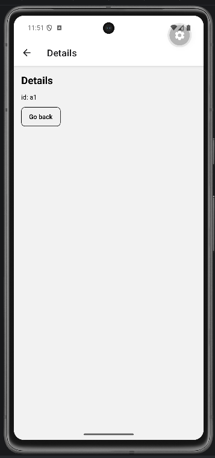

# Lab 14 – Parametri di route e navigazione dinamica

## Obiettivo

- Lista con `FlatList` → navigazione a dettaglio con `id`.
- Gestisci almeno un edge case con un messaggio chiaro.

## Timebox

2h

## Prerequisiti

- PC con Node.js LTS installato
- VS Code e Git
- Expo oppure React Native CLI (Android)
- Android emulator oppure telefono reale

## Scenario

Lista con `FlatList` → navigazione a dettaglio con `id`. Validazione parametro: id mancante o item non trovato.

> **Perché questo lab:** esercitare i pattern della lezione 14 in una mini-app concreta.

## Cosa imparerai

1. Come passare parametri con `navigation.navigate("Details", { id: item.id })`.
2. Come leggere i parametri con `route.params?.id`.
3. Come validare parametri (difensivo): se mancano → fallback UI.
4. Come cercare un item nel dataset e gestire "non trovato".

## Passi

1. **Installa dipendenze** — React Navigation (se non già presente).
2. **HomeScreen** — `FlatList` con 3 items. Ogni riga naviga a Details con l'`id`.
3. **DetailsScreen** — Legge `route.params?.id`, cerca l'item nel dataset.
4. **Fallback** — Se `id` manca → "Invalid route param". Se item non esiste → "Product not found".
5. **Go back** — Pulsante per tornare.

## Screenshot attesi

**Lista items**

**Dettaglio**

## Consegna minima

- App che parte su emulatore o device
- UI chiara e leggibile
- Un edge case gestito con un messaggio chiaro

## Checkpoint

- [ ] Avvio progetto senza errori
- [ ] Feature completata e dimostrabile
- [ ] Edge case gestito con messaggio chiaro
- [ ] Cleanup completato

## Problemi comuni

- Se Metro non parte: chiudi processi in ascolto e riavvia `npx expo start`.
- Se l'emulatore è lento: verifica virtualizzazione/KVM/Hyper-V o usa device reale.
- Se l'app non si connette: controlla che PC e device siano sulla stessa rete (LAN).

## Cleanup

- Stoppa Metro bundler (CTRL+C).
- Chiudi emulator e libera risorse.
- Se hai usato permessi (camera/location): revoca i permessi dall'OS.
- Se hai usato storage locale: svuota i dati dell'app o rimuovi le chiavi salvate.

## Search terms

- react navigation route params
flatlist navigation react native
