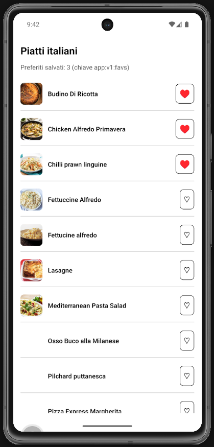

# Lab 16 - Persistenza locale: preferiti con AsyncStorage (Italian Meals App)

## Obiettivo

- Salvare i **preferiti** (`idMeal`) con `AsyncStorage`.
- Chiave obbligatoria progetto finale: **`app:v1:favs`**.
- Gestire almeno un edge case (lista vuota o JSON corrotto).

## Timebox

2h

## Prerequisiti

- PC con Node.js LTS installato
- VS Code e Git
- Expo oppure React Native CLI (Android)
- Android emulator oppure telefono reale
- **Lab 15 completato** (lista + dettaglio da TheMealDB)

## Scenario

Continua la **Italian Meals App**. L'utente tocca ♡ su un piatto (lista o dettaglio): l'`idMeal` viene salvato in AsyncStorage e resta disponibile dopo il riavvio dell'app.

> **Perché questo lab:** i preferiti sono una feature obbligatoria del progetto finale (checkpoint 9 luglio). Qui impari load / save / reset con una chiave versionata.

## Cosa imparerai

1. Come installare `@react-native-async-storage/async-storage`.
2. Come usare `getItem`, `setItem` con JSON (`JSON.stringify` / `JSON.parse`).
3. Come caricare preferiti al mount con `useEffect`.
4. Come sincronizzare UI (♡ / ♥) con i dati su disco.

## Dipendenze (Expo)

```bash
npx expo install @react-native-async-storage/async-storage
```

## Passi

1. **Installa** - `npx expo install @react-native-async-storage/async-storage`.
2. **services/storage.ts** - `FAVORITES_KEY = "app:v1:favs"`; `loadFavoriteIds()` e `saveFavoriteIds(ids: string[])`.
3. **FavoriteButton** - componente con prop `idMeal`; mostra ♡ o ♥ in base allo stato.
4. **Integrazione** - Aggiungi `FavoriteButton` su `MealCard` (lista) e su `MealDetailScreen` (dettaglio).
5. **Persistenza** - Al toggle, aggiorna array in memoria e chiama `saveFavoriteIds`.
6. **Load al mount** - Carica preferiti all'avvio (in screen o hook dedicato).
7. **Edge case** - Chiave assente → array vuoto; JSON invalido → array vuoto senza crash.

## Screenshot attesi

**Preferito attivo - cuore vuoto**


**Preferiti persistiti - riavvio app, cuore pieno e ancora attivo**



## Consegna minima

- Toggle ♡ / ♥ su lista e dettaglio
- Chiave `app:v1:favs` con array di `idMeal`
- Preferiti sopravvivono al riavvio dell'app
- Edge case JSON/chiave assente gestito

## Checkpoint

- [ ] Avvio progetto senza errori
- [ ] AsyncStorage solo in `services/storage.ts`
- [ ] Toggle preferito funzionante su almeno 2 schermate
- [ ] Edge case gestito senza crash
- [ ] Screenshot in Google Doc (riga **Lab 16**)

## Problemi comuni

- Se Metro non parte: chiudi processi in ascolto e riavvia `npx expo start`.
- Se i preferiti spariscono: verifica di chiamare `saveFavoriteIds` **dopo** ogni toggle.
- Se vedi `[object Object]`: salva un **array di stringhe**, non oggetti meal interi.

## Cleanup

- Stoppa Metro bundler (CTRL+C).
- Chiudi emulator e libera risorse.
- Opzionale: svuota dati app o `AsyncStorage.removeItem("app:v1:favs")`.

## Search terms

- asyncstorage react native
- expo install asyncstorage
- json stringify asyncstorage
- app:v1:favs italian meals
