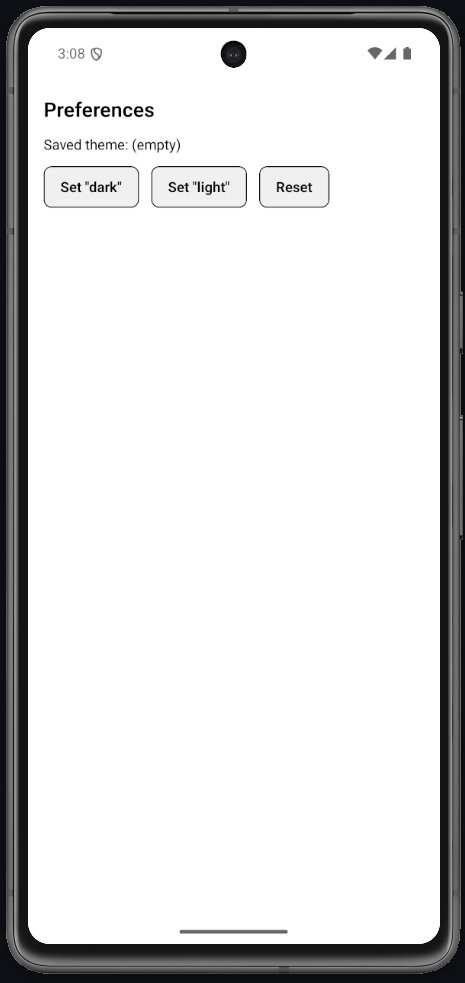

# Lab 16 – Fetch / Axios e chiamate REST

## Obiettivo

- Carica dati da REST API con `fetch`, mostra in `FlatList`.
- Gestisci almeno un edge case con un messaggio chiaro.

## Timebox

2h

## Prerequisiti

- PC con Node.js LTS installato
- VS Code e Git
- Expo oppure React Native CLI (Android)
- Android emulator oppure telefono reale

## Scenario

Carica dati da REST API con `fetch`, mostra in `FlatList`. Gestisci loading / error / success.

> **Perché questo lab:** esercitare i pattern della lezione 16 in una mini-app concreta.

## Cosa imparerai

1. Come usare `fetch` con controllo `res.ok`.
2. Come gestire errori HTTP (non trattarli come successo).
3. Come mostrare i dati con `FlatList`.
4. Il pattern load → .then → .catch.

## Passi

1. **Avvia progetto** — verifica che l'app parta.
2. **Funzione loadPosts()** — `fetch` da `jsonplaceholder.typicode.com/posts?_limit=5` con controllo `res.ok`.
3. **Schermata** — 3 stati: loading, error (con Retry), success (FlatList).
4. **useEffect** — Chiama `load()` al mount.
5. **Edge case** — Simula errore (URL sbagliata) e mostra messaggio con pulsante Retry.

## Screenshot attesi

**Posts**

**Errore**

## Consegna minima

- App che parte su emulatore o device
- UI chiara e leggibile
- Un edge case gestito con un messaggio chiaro

## Checkpoint

- [ ] Avvio progetto senza errori
- [ ] Feature completata e dimostrabile
- [ ] Edge case gestito con messaggio chiaro
- [ ] Cleanup completato

## Problemi comuni

- Se Metro non parte: chiudi processi in ascolto e riavvia `npx expo start`.
- Se l'emulatore è lento: verifica virtualizzazione/KVM/Hyper-V o usa device reale.
- Se l'app non si connette: controlla che PC e device siano sulla stessa rete (LAN).

## Cleanup

- Stoppa Metro bundler (CTRL+C).
- Chiudi emulator e libera risorse.
- Se hai usato permessi (camera/location): revoca i permessi dall'OS.
- Se hai usato storage locale: svuota i dati dell'app o rimuovi le chiavi salvate.

## Search terms

- fetch api react native
jsonplaceholder posts
react native flatlist data
