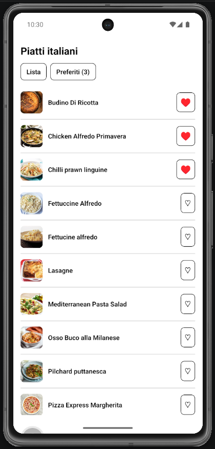
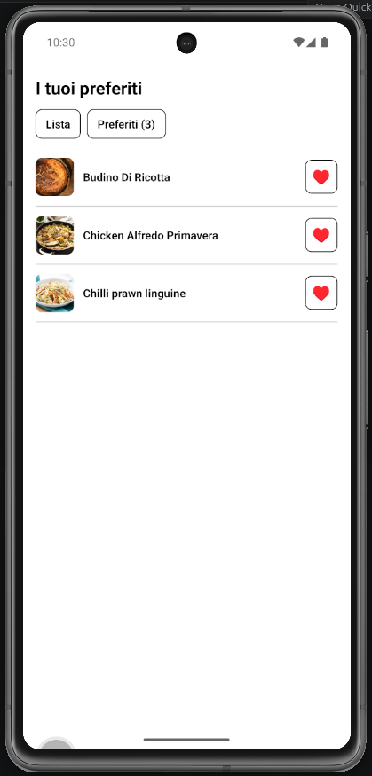

# Lab 17 - Stato globale: Context per preferiti (Italian Meals App)

## Obiettivo

- Esporre i **preferiti** come stato globale con **Context + Provider**.
- Architettura modulare: `services/` + `context/` + `screens/`.
- Schermata **Preferiti** che legge lo stesso stato della lista.

## Timebox

2h

## Prerequisiti

- PC con Node.js LTS installato
- VS Code e Git
- Expo oppure React Native CLI (Android)
- Android emulator oppure telefono reale
- **Lab 16 completato** (AsyncStorage `app:v1:favs`)

## Scenario

Continua la **Italian Meals App**. Nel lab 16 i preferiti possono vivere in uno stato locale; ora li centralizzi in `FavoritesContext` così lista, dettaglio e schermata **Preferiti** condividono gli stessi dati senza prop drilling.

| Lab 16                                | Lab 17                                   |
| ------------------------------------- | ---------------------------------------- |
| Toggle + save in screen/hook locale   | `FavoritesContext` + `useFavorites()`    |
| Solo lista/dettaglio                  | Aggiungi `FavoritesScreen` nel navigator |
| AsyncStorage in `services/storage.ts` | Stesso service; Context chiama load/save |

> **Perché questo lab:** il progetto finale richiede stato globale (preferiti, sessione utente, tema). Qui ti concentri sui **preferiti**; `AuthContext` resta quello del login (lab 11–13).

## Cosa imparerai

1. Come creare `FavoritesContext` con `React.createContext`.
2. Come caricare preferiti al mount del Provider e persistere al toggle.
3. Come consumare `useFavorites()` in `MealCard`, `MealDetailScreen`, `FavoritesScreen`.
4. Confronto mentale: Context vs prop drilling vs Zustand (solo teorico).

## Passi

1. **context/FavoritesContext.tsx** - `favoriteIds`, `isLoading`, `isFavorite(idMeal)`, `toggleFavorite(idMeal)`.
2. **Load al mount** - `loadFavoriteIds()` nel Provider; `isLoading` finché non finisce.
3. **Persist** - `toggleFavorite` aggiorna stato e chiama `saveFavoriteIds`.
4. **FavoriteButton** - usa `useFavorites()` invece di props/state locale.
5. **screens/FavoritesScreen.tsx** - `fetchItalianMeals()` per filtrare per `idMeal` in `favoriteIds`; riusa `MealCard`.
6. **Navigator** - aggiungi route `Favorites` (es. da icona ♥ nell'header).
7. **App.tsx / RootNavigator** - avvolgi con `FavoritesProvider` (dentro `AuthProvider` se già presente).
8. **Edge case** - Preferiti vuoti → messaggio «Nessun preferito ancora. Tocca ♡ su un piatto dalla lista.»

## Screenshot attesi

**Lista piatti - preferiti attivi condivisi via Context (♥ su più piatti, contatore in header)**

**Schermata Preferiti - stessi idMeal filtrati dalla lista (titolo «I tuoi preferiti»)**

## Consegna minima

- `FavoritesContext` + hook `useFavorites()`
- Toggle sincronizzato su lista, dettaglio e schermata Preferiti
- AsyncStorage solo in `services/storage.ts`
- Edge case lista preferiti vuota

## Checkpoint

- [ ] Avvio progetto senza errori
- [ ] Nessun `useState` duplicato per preferiti nelle screen
- [ ] `FavoritesScreen` nel navigator
- [ ] Edge case gestito con messaggio chiaro
- [ ] Screenshot in Google Doc (riga **Lab 17**)

## Problemi comuni

- Se Metro non parte: chiudi processi in ascolto e riavvia `npx expo start`.
- Se il cuore non si aggiorna: verifica che `FavoriteButton` usi `useFavorites()`, non uno stato locale.
- Se Preferiti è vuoto ma i cuori sono attivi: controlla che `FavoritesScreen` filtri con gli stessi `idMeal` salvati.

## Cleanup

- Stoppa Metro bundler (CTRL+C).
- Chiudi emulator e libera risorse.

## Search terms

- react context provider usecontext
- favorites context react native
- creatcontext react native
