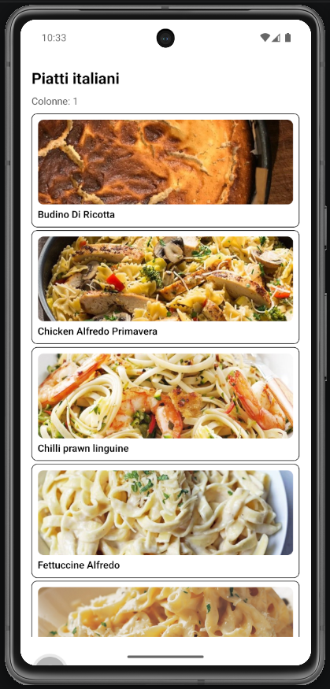
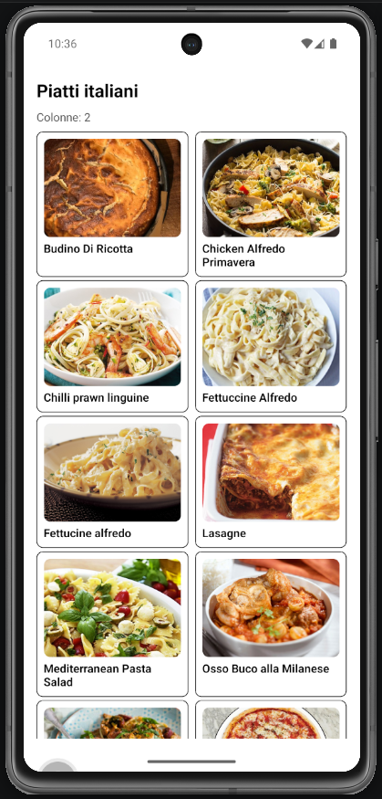

# Lab 18 - UI styling: StyleSheet, flexbox e layout responsive (Italian Meals App)

## Obiettivo

- Centralizzare gli stili con `StyleSheet.create` e **spacing tokens**.
- Layout responsive della **lista piatti** con `useWindowDimensions`.
- Gestire almeno un edge case (nome piatto lungo che wrappa).

## Timebox

2h

## Prerequisiti

- PC con Node.js LTS installato
- VS Code e Git
- Expo oppure React Native CLI (Android)
- Android emulator oppure telefono reale
- **Lab 15–17 completati** (lista, API, preferiti)

## Scenario

Continua la **Italian Meals App**. La lista piatti deve essere leggibile su telefono e tablet: **1 colonna** su schermo stretto, **2 colonne** su schermo largo. Tutti gli stili riusabili vivono in `theme/styles.ts` (funzione `createSharedStyles`).

> **Perché questo lab:** il progetto finale richiede UI responsive e StyleSheet condiviso, non stili inline sparsi nelle screen.

## Cosa imparerai

1. Come definire `spacing` in `theme/colors.ts`.
2. Come creare `createSharedStyles()` in `theme/styles.ts`.
3. Come usare `useWindowDimensions` con breakpoint `width >= 600`.
4. Come impostare `FlatList` con `numColumns={2}` e `columnWrapperStyle` su tablet.

## Passi

1. **theme/colors.ts** - tokens `spacing` (`xs`, `sm`, `md`, `lg`).
2. **theme/styles.ts** - `createSharedStyles(theme)` con stili per `screen`, `listItem`, `rowCenter`, `flatListContent`, ecc.
3. **MealsListScreen** - `const isWide = width >= 600`; `numColumns={isWide ? 2 : 1}`; cambia `key` della FlatList quando cambia il numero di colonne.
4. **MealCard** - usa stili condivisi (`listItem`, `listTitle`, `rowCenter`); niente oggetti inline.
5. **Componenti riusabili** - `LoadingView`, `ErrorView`, `UserHeader` con gli stessi stili condivisi.
6. **Edge case** - Nome piatto lungo: `numberOfLines` o wrap corretto; lista vuota dopo filtro ricerca con messaggio chiaro.

## Screenshot attesi

**Layout mobile - lista a 1 colonna**

**Layout tablet - lista a 2 colonne**

## Consegna minima

- `createSharedStyles` usato in lista e componenti principali
- Breakpoint responsive funzionante (ruota emulatore o ridimensiona finestra)
- Spacing coerente con tokens
- Nessuno stile inline nelle screen del lab

## Checkpoint

- [ ] Avvio progetto senza errori
- [ ] `useWindowDimensions` + breakpoint 600px
- [ ] Stili in `theme/styles.ts`, non duplicati
- [ ] Edge case testo lungo / lista vuota
- [ ] Screenshot in Google Doc (riga **Lab 18**)

## Problemi comuni

- Se Metro non parte: chiudi processi in ascolto e riavvia `npx expo start`.
- Se FlatList crasha con 2 colonne: cambia la prop `key` quando passi da 1 a 2 colonne.
- Se gli stili non si aggiornano: verifica di chiamare `createSharedStyles(theme)` dentro il componente.

## Cleanup

- Stoppa Metro bundler (CTRL+C).
- Chiudi emulator e libera risorse.

## Search terms

- useWindowDimensions react native
- flexbox responsive flatlist numColumns
- stylesheet create react native
- createSharedStyles theme
