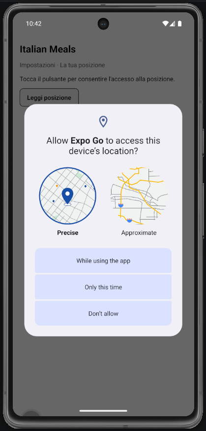
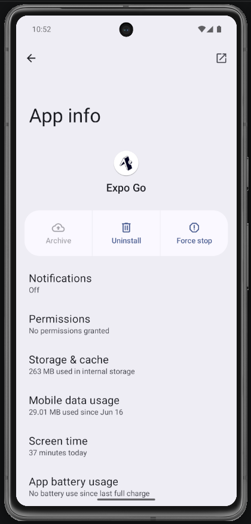

# Lab 20 - Funzionalità native: geolocalizzazione in Impostazioni (Italian Meals App)

## Obiettivo

- Integrare **expo-location** nella **Italian Meals App** (schermata Impostazioni).
- Flusso permission-first: richiedi permesso → leggi coordinate.
- Fallback se negato con link a Settings.

## Timebox

2h

## Prerequisiti

- PC con Node.js LTS installato
- VS Code e Git
- Expo oppure React Native CLI (Android)
- Android emulator oppure telefono reale
- **Lab 15–19 completati** (app funzionante con lista, preferiti, tema)

## Scenario

Continua la **Italian Meals App**. In **Impostazioni**, aggiungi una sezione «La tua posizione» (opzionale per il checkpoint 9 luglio, obbligatoria come esercizio del lab): l'utente può vedere lat/lng mentre consulta ricette italiane - utile per capire permessi nativi nel contesto del progetto finale.

> **Perché questo lab:** le feature native (lab 20) si integrano nell'app esistente, non in una mini-app separata.

## Cosa imparerai

1. Come installare `expo-location`.
2. Come fare bootstrap con `getForegroundPermissionsAsync()` al mount.
3. Come richiedere permesso con `requestForegroundPermissionsAsync`.
4. Come gestire denied → `Linking.openSettings()` senza bloccare il resto dell'app.

## Dipendenze (Expo)

```bash
npx expo install expo-location
```

## Passi

1. **Installa** - `npx expo install expo-location`.
2. **Sezione in SettingsScreen** - titolo «La tua posizione» sotto preferiti/tema.
3. **Bootstrap** - al mount: `getForegroundPermissionsAsync()` → stato `unknown` / `denied` / `granted`.
4. **Pulsante «Leggi posizione»** - `requestForegroundPermissionsAsync` → se granted, `getCurrentPositionAsync`.
5. **Fallback** - denied → messaggio + «Apri Impostazioni»; GPS non disponibile → `getLastKnownPositionAsync()` + messaggio chiaro.
6. **Edge case** - Permesso negato: logout, preferiti e lista devono restare usabili.
7. **Emulatore** - Imposta posizione mock (Extended controls → Location) o prova su device reale.

## Screenshot attesi

**Permesso richiesto - sezione posizione in Impostazioni**



**Posizione ottenuta - coordinate mostrate**



## Consegna minima

- Sezione geolocalizzazione in **SettingsScreen** (o componente dedicato)
- UI per stati unknown / denied / granted / loading / error
- App usabile anche se permesso negato
- Documenta in README limiti emulatore vs device reale

## Checkpoint

- [ ] Avvio progetto senza errori
- [ ] Permission-first implementato
- [ ] Fallback Settings su denied
- [ ] Edge case GPS non disponibile
- [ ] Screenshot in Google Doc (riga **Lab 20** - o nota «non implementato»)

## Problemi comuni

- Se Metro non parte: chiudi processi in ascolto e riavvia `npx expo start`.
- Se resta su «Checking permission…»: usa `getForegroundPermissionsAsync()` al mount.
- Se resta su «Reading…»: `try/catch` + fallback `getLastKnownPositionAsync()`.
- Su emulatore Android: imposta posizione mock o usa device reale.

## Cleanup

- Stoppa Metro bundler (CTRL+C).
- Revoca permesso location da Impostazioni → Expo Go.

## Search terms

- expo-location permissions
- react native linking openSettings
- geolocation settings screen
