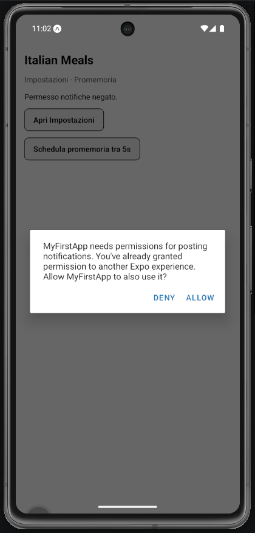
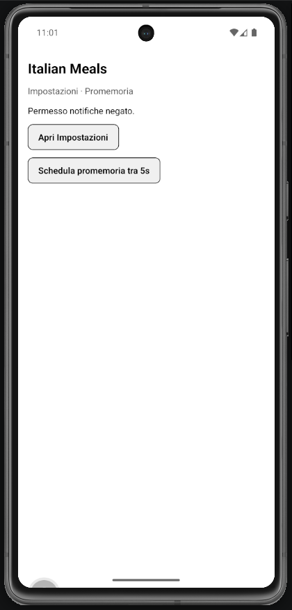
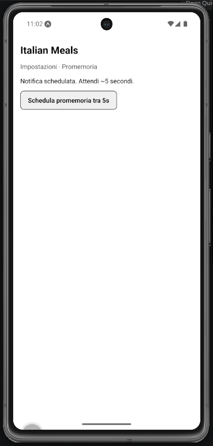
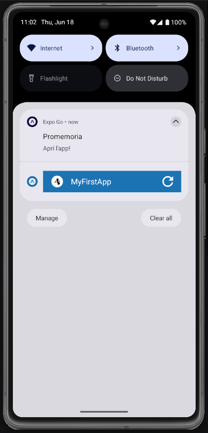

# Lab 21 - Notifiche locali: promemoria preferiti (Italian Meals App)

## Obiettivo

- Schedulare una **notifica locale** con `expo-notifications` nella **Italian Meals App**.
- Flusso permessi e gestione rifiuto integrato in **Impostazioni**.
- Messaggi in italiano: **Promemoria** / **Apri l'app!**

## Timebox

2h

## Prerequisiti

- PC con Node.js LTS installato
- VS Code e Git
- Expo oppure React Native CLI (Android)
- Android emulator oppure telefono reale
- **Lab 15–19 completati** (preferiti con Context consigliato)

## Scenario

Continua la **Italian Meals App**. In **Impostazioni**, aggiungi «Schedula promemoria»: tra 5 secondi arriva una notifica locale che invita ad aprire l'app (opzionale: body con numero preferiti, es. «Hai 3 piatti nei preferiti!»).

> **Perché questo lab:** notifiche e task background si integrano nel progetto finale; feature **opzionale** per il checkpoint 9 luglio.

## Cosa imparerai

1. Come installare `expo-notifications`.
2. Come importare solo API **locali** da `expo-notifications/build/...` (Expo Go SDK 53+).
3. Come controllare e richiedere permesso (`getPermissionsAsync` / `requestPermissionsAsync`).
4. Come creare canale Android e schedulare notifica a 5 secondi.
5. Come gestire UI per ogni stato (`unknown`, `granted`, `denied`, `scheduled`, `error`).

## Dipendenze (Expo)

```bash
npx expo install expo-notifications
```

## Passi

1. **Installa** - `npx expo install expo-notifications`.
2. **Import statico (local-only)** - da `expo-notifications/build/...` con **named import** (`{ scheduleNotificationAsync }`, `{ setNotificationChannelAsync }`); **non** default import; **non** `import * as Notifications from "expo-notifications"`.
3. **setupExpoGoWarnings.ts** (opzionale) - `LogBox.ignoreLogs` per WARN push harmless in Expo Go; import in `App.tsx` root.
4. **setNotificationHandler** - `shouldShowBanner` + `shouldShowList`.
5. **Sezione in SettingsScreen** - pulsante «Schedula promemoria tra 5s».
6. **Canale Android** - `setNotificationChannelAsync("default", { name: "Promemoria", … })` prima del permesso.
7. **onSchedule()** - `requestPermissionsAsync` → `scheduleNotificationAsync({ title: "Promemoria", body: "Apri l'app!", trigger: 5s })`.
8. **Edge case** - Permesso negato → messaggio + **Apri Impostazioni** (`Linking.openSettings()`).
9. **README** - Annota limiti background (policy OS, batteria, Expo Go).

## Screenshot attesi

**Schermata Impostazioni - sezione notifiche**





**Notifica schedulata**



**Notifica pubblicata**



## Consegna minima

- Sezione notifiche in **SettingsScreen** (o schermata dedicata nel navigator)
- Notifica locale funzionante in Expo Go (solo API locali)
- UI in italiano per ogni stato permesso
- Edge case permesso negato gestito

## Checkpoint

- [ ] Avvio progetto senza errori
- [ ] Import da `expo-notifications/build/...`
- [ ] Canale Android creato prima del permesso
- [ ] Notifica visibile dopo ~5 secondi
- [ ] Screenshot in Google Doc (riga **Lab 21** - o nota «non implementato»)

## Problemi comuni

- Se Metro non parte: chiudi processi in ascolto e riavvia `npx expo start`.
- **Red Box** `JSBigFileString::fromPath`: causato da `import()` dinamico - usa import statico.
- **TypeError: undefined is not a function**: `scheduleNotificationAsync` e `setNotificationChannelAsync` sono **named export** — usa `import { scheduleNotificationAsync } from "..."`, non default import.
- **Console Error** push in Expo Go: non importare il barrel `expo-notifications`.
- Su Android 13+: crea notification channel prima del permesso.
- **NullPointerException / `setNotificationChannelAsync` rejected** in Expo Go: il provider dei canali può non essere disponibile. Avvolgi `setNotificationChannelAsync` in `try/catch` (best-effort): la notifica locale funziona comunque.
- Permesso già concesso: in Expo Go il permesso è sull'app **Expo Go**, non sul tuo progetto.

## Cleanup

- Stoppa Metro bundler (CTRL+C).
- Revoca permesso notifiche: Impostazioni → Expo Go → Notifiche.

## Search terms

- expo-notifications schedule local
- expo-notifications build import
- italian meals promemoria notification
