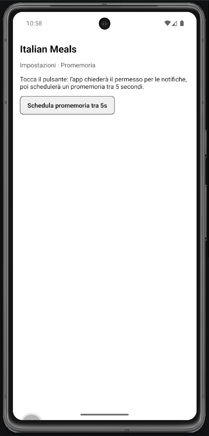

# Lab 21 – Temi, UI kit, accessibilità e animazioni base

## Obiettivo

- Oggetto `theme` con design tokens.
- Gestisci almeno un edge case con un messaggio chiaro.

## Timebox

2h

## Prerequisiti

- PC con Node.js LTS installato
- VS Code e Git
- Expo oppure React Native CLI (Android)
- Android emulator oppure telefono reale

## Scenario

Oggetto `theme` con design tokens. `accessibilityRole` e `maxFontSizeMultiplier` per a11y.

> **Perché questo lab:** esercitare i pattern della lezione 21 in una mini-app concreta.

## Cosa imparerai

1. Come creare un oggetto theme con spacing, radius, fontSize.
2. Come usare `accessibilityRole="button"` sui Pressable.
3. Come usare `maxFontSizeMultiplier` per limitare il scaling del testo.
4. Come dare feedback visivo con opacity su `pressed`.

## Passi

1. **Avvia progetto** — verifica che l'app parta.
2. **Theme object** — `const theme = { spacing: 12, radius: 12, titleSize: 20 }`.
3. **Card** — Componente che usa `theme.spacing` e `theme.radius`.
4. **Pressable accessibile** — `accessibilityRole="button"`, opacity su pressed.
5. **maxFontSizeMultiplier** — Aggiungi a `Text` per limitare il scaling.
6. **Edge case** — Aumenta la font size del device e verifica che il layout regga.

## Screenshot attesi

**UI kit demo**

## Consegna minima

- App che parte su emulatore o device
- UI chiara e leggibile
- Un edge case gestito con un messaggio chiaro

## Checkpoint

- [ ] Avvio progetto senza errori
- [ ] Feature completata e dimostrabile
- [ ] Edge case gestito con messaggio chiaro
- [ ] Cleanup completato

## Problemi comuni

- Se Metro non parte: chiudi processi in ascolto e riavvia `npx expo start`.
- Se l'emulatore è lento: verifica virtualizzazione/KVM/Hyper-V o usa device reale.
- Se l'app non si connette: controlla che PC e device siano sulla stessa rete (LAN).

## Cleanup

- Stoppa Metro bundler (CTRL+C).
- Chiudi emulator e libera risorse.
- Se hai usato permessi (camera/location): revoca i permessi dall'OS.
- Se hai usato storage locale: svuota i dati dell'app o rimuovi le chiavi salvate.

## Search terms

- react native accessibilityRole
maxFontSizeMultiplier react native
design tokens react native
